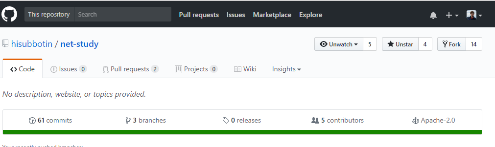
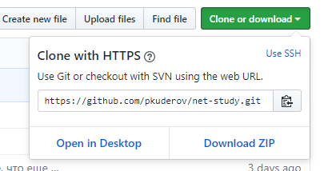
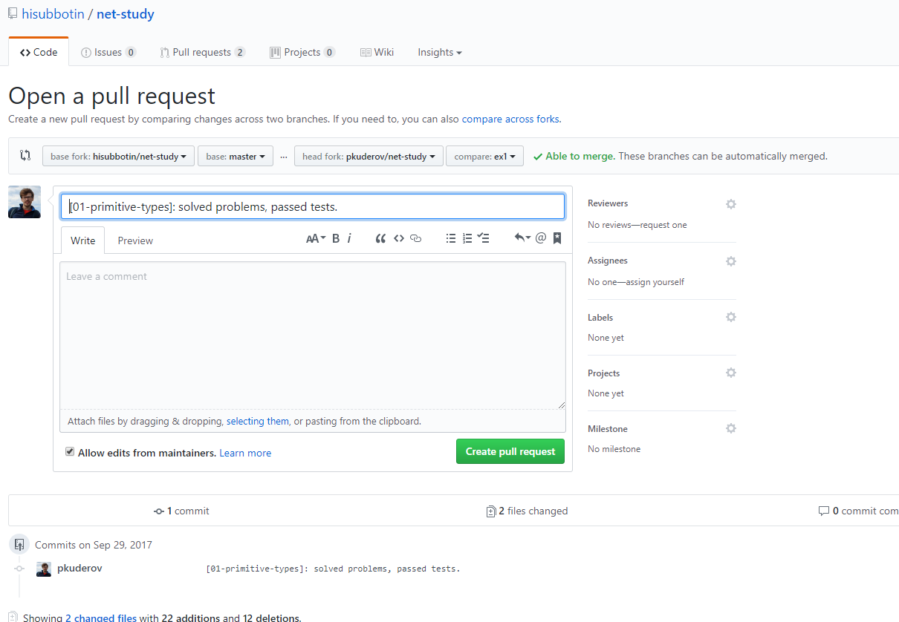

# Git + GitHub workflow

В целом воркфлоу будет таким:

- делаешь форк репозитория,
- выполняешь задание в своем форке,
- когда все готово, делаешь пулл реквест и ждешь комментариев,
- если нужна будет доработка, делаешь доп коммиты,
- если же все ок, твой пулл реквест закроют и добавят в табличку отметку о сдаче.

Теперь чуть подробнее.

## Как сделать форк и склонировать его к себе

На главной странице репозитория курса на гитхабе нажимаешь на `Fork` сверху справа:



Гитхаб создаст форк репозитория на твоем аккаунте и это будет выглядеть примерно так (обрати внимание на указание об этом под названием репозитория):


Дальше жмешь на зеленую кнопку `Clone or download` и далее на кнопку `Copy to clipboard` справа от адреса:



Теперь в консоли на своем компе идешь в нужную папку, куда хочешь склонировать, и клонируешь свой форк:

```sh
# go to your project folder
cd c:/dev

# git clone your fork (here's a link to my fork, not yours!!!)
git clone https://github.com/pkuderov/net-study.git
```

## Как начать работать

### Что в начале

После того как склонировал[a], ради интереса посмотри какие есть ветки:

```sh
# list all local and remote branches
git branch -va
```

Должно быть что-то вроде такого: одна локальная ветка мастера и какое-то количество "унаследованных" при форке веток из изначального репозитория.

```txt
* master                    ae3da27 Merge pull request #7 from krivchnik/master
  remotes/origin/HEAD       -> origin/master
  remotes/origin/dev-course 3214656 Начинаем след. лекцию
  remotes/origin/dev-ex3    327304e [03-drunk-fibonacci]: добавил начало наброска задания.
  remotes/origin/master     ae3da27 Merge pull request #7 from krivchnik/master
```

И то же самое с ремоутами:

```sh
# list all remotes
git remote -v
```

Будет один ремоут `origin`, который указывает на твой форк. У меня это выглядит так:

```txt
origin  https://github.com/pkuderov/net-study.git (fetch)
origin  https://github.com/pkuderov/net-study.git (push)
```

### Синхронизация с изначальным репозиторием, от которого форкнулся[-ась]

Очень желательно, чтобы твой форк был синхронизирован с изначальным репозиторием, потому что в него в течение курса будут добавляться новые задания и лекции. Для этого сначала необходимо добавить его в ремоуты. Ниже добавление ссылки на изначальный репозиторий под именем `upstream`. Название может быть выбрано произвольное, но вроде как народ обычно так называет:

```sh
## add remote upstream linked to the main repo
git remote add upstream https://github.com/hisubbotin/net-study.git
```

Проверь, что он появился в списке ремоутов:

```sh
git remote -v
```

У меня теперь так:

```txt
origin  https://github.com/pkuderov/net-study.git (fetch)
origin  https://github.com/pkuderov/net-study.git (push)
upstream        https://github.com/hisubbotin/net-study.git (fetch)
upstream        https://github.com/hisubbotin/net-study.git (push)
```

А после того, как заберем данные из `upstream`

```sh
# download upstream data
git fetch upstream

# list all local and remote branches
git branch -va
```

, у нас появятся и его ветки (вывод последней команды):

```txt
* master                      f33b1be [ahead 1] [01-primitive-types]: solved problems, passed tests.
  remotes/origin/HEAD         -> origin/master
  remotes/origin/dev-course   3214656 Начинаем след. лекцию
  remotes/origin/dev-ex3      327304e [03-drunk-fibonacci]: добавил начало наброска задания.
  remotes/origin/master       ae3da27 Merge pull request #7 from krivchnik/master
  remotes/upstream/dev-course 3214656 Начинаем след. лекцию
  remotes/upstream/dev-ex3    327304e [03-drunk-fibonacci]: добавил начало наброска задания.
  remotes/upstream/master     ae3da27 Merge pull request #7 from krivchnik/master
```

Видишь, появились ветки `remotes/upstream/...`. Не бойся, запушить в них все равно не получится - у тебя не хватит прав, поэтому случайно поломать данные в `upstream` не выйдет.

### Ближе к делу

Желательно создать новую ветку, в которой ты будешь делать задание. Например, можно под каждое задание заводить отдельную ветку и называть их как-нибудь так: `ex1`, `ex2`,...

И можно еще завести накопительную ветку (что-нибудь типа `done`), в которую ты будешь вливать все сданные задания. Тогда в конце курса в ней будут все твои сделанные лабы вместе взятые. Но это не обязательно.

Итак, например, ты планируешь начать выполнять первое задание. Тогда создаешь ветку `ex1` (или с любым другим названием):

```sh
## go to master first
git checkout master

## then create new branch with the name ex1 on top of it
git checkout -b ex1
```

Теперь самое время немного покодить ;)

## Как держать свой форк синхронизированным с `upstream`

Просто периодически подпулливай изменения из `upstream` в твой `master`:

```sh
# go to master
git checkout master

# fetch the whole upstream and merge our master with upstream's master
git fetch upstream
git merge upstream/master
```

Таким образом ты сможешь держать в актуальном состоянии свою ветку `master`. И этим же способом можно держать в актуальном состоянии любую ветку (например, ветку `done`, если захочешь ее сделать, или твою текущую ветку задания `exN`)

### Хозяйке на заметку или для тех, кто любит позапутаннее

Тем не менее, несмотря на то, что так можно держать синхронизированной ветку текущего задания, некоторые предпочитают другой способ - делать `git rebase`. Т.е. `master`, как это написано выше, держится актуальным с помощью мерджа с `upstream`, а вот ветка с фичей/заданием `exN` иногда (либо вообще только перед самым пулл реквестом) перебазируется на актуальный `master`:

```sh
# go to master and sync it with upstream/master
git checkout master
git fetch upstream
git merge upstream/master

# rebase your development branch (e.g. ex1)
git checkout ex1
git rebase master
```

С одной стороны такой вариант лучше тем, что пулл реквест в итоге оказывается чище (там нет коммитов с мерджами синхронизации). Это не так важно в нашем случае, т.к. ваш пулл реквест все равно отклонят, но бывает важно в реальной жизни - тогда мердж будет более красивым и линейным `fast forward` мерджем.

С другой стороны `rebase` переписывает историю, а значит отличный кандидат на способ случайно получить стрелу в колено.

За доп инфой, прыгай по [ссылке](https://www.atlassian.com/git/tutorials/merging-vs-rebasing).

## У меня коммиты с лучшим в мире решением, что дальше

Дальше время делать пулл реквест. Для начала последний раз синхронизируй свой `master` и `exN`, пуш коммиты (если есть что пушить) в свой форк-репозиторий и создавай пулл реквест.

Во-первых, сам гитхаб тебе будет периодически сам высвечивать предложение его сделать, во-вторых, рядом с дропдауном с текущей веткой тоже есть кнопка `New pull request`, в-третьих, есть отдельная вкладочку сверху `Pull requests`, на которой тоже есть кнопка для его создания.

Далее ты выбираешь:

- слева - **куда**, т.е. **в** какой репозиторий и его ветку ты хочешь влиться,
- справа - **откуда**, т.е. **из** какого репозитория и его ветки ты хочешь влить.



Потом пишешь понятное преподавателю название пулл реквеста с номером задания и своей фамилией. Опционально оставляешь приятный глазу комментарий ;) ну или вопросы какие, уточнения, все что душе угодно. Наконец жмешь `Create pull request` и ждешь ответа.

Когда мы с тобой добьемся удовлетворяющего меня результата, пулл реквест будет закрыт (отвергнут) и появится отметка об успешном завершении задания в соотв. табличке.

## Credits

Основано на следующем [гайде](https://gist.github.com/Chaser324/ce0505fbed06b947d962) от [`Chaser324`](https://github.com/Chaser324).