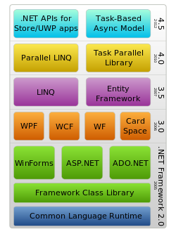
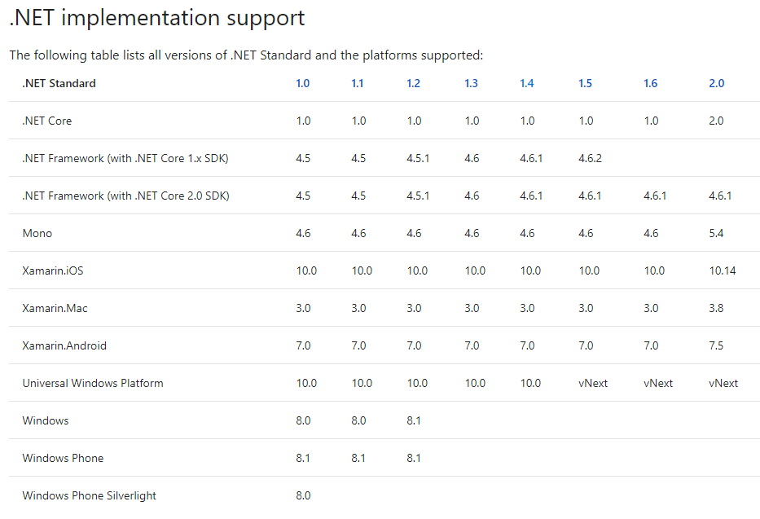
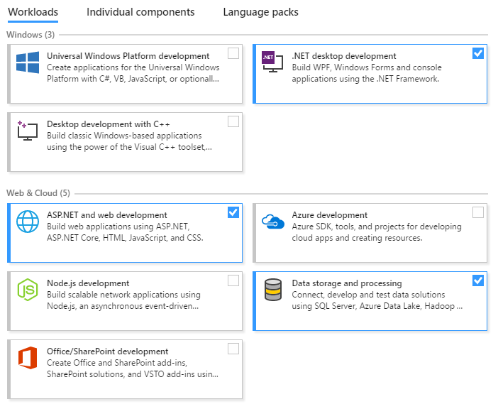
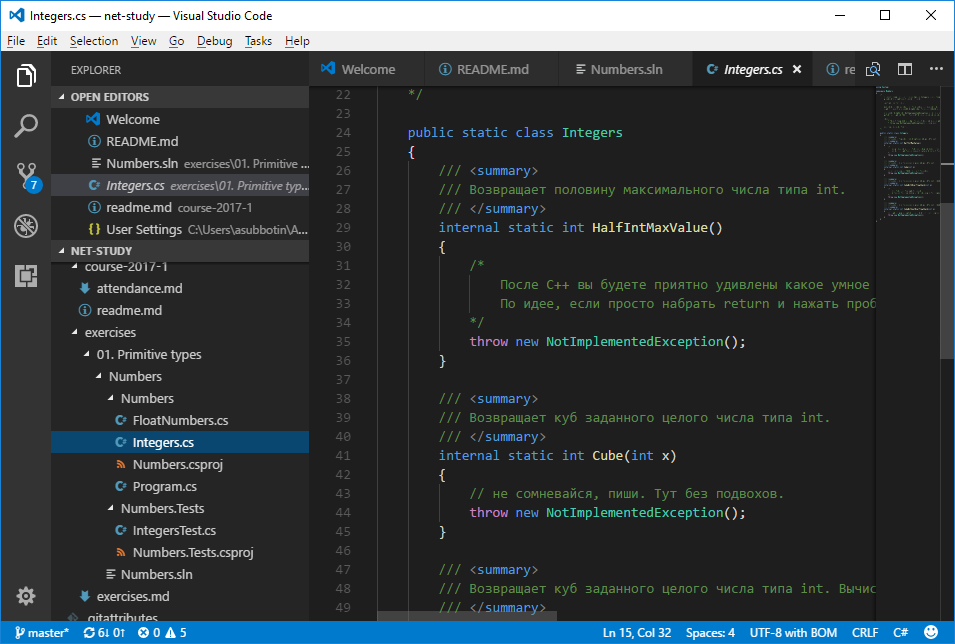
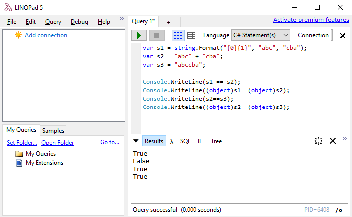
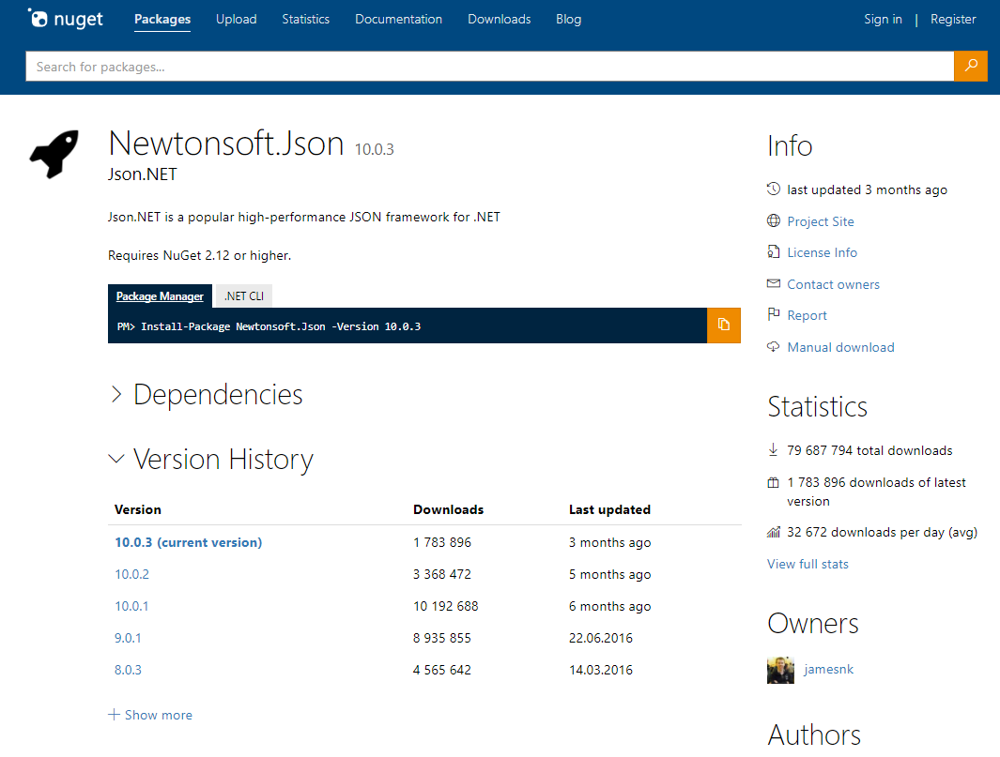
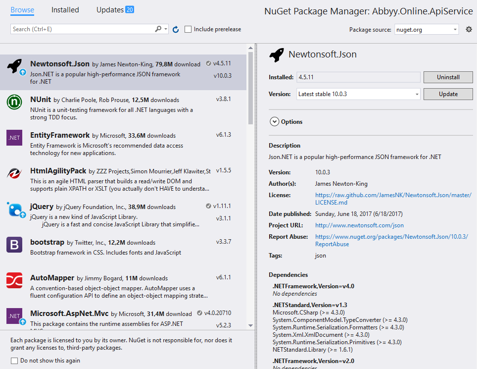

# .Net

<!-- TOC -->

- [.Net](#net)
  - [Литература](#Литература)
  - [Использование и применение](#Использование-и-применение)
    - [Применение](#Применение)
  - [.NET Framework](#net-framework)
  - [CLR](#clr)
  - [История версий](#История-версий)
  - [.NET Core](#net-core)
    - [Command-line interface tools](#command-line-interface-tools)
  - [.NET Standard](#net-standard)
  - [.NET Native](#net-native)
  - [IDE](#ide)
  - [Nuget](#nuget)

<!-- /TOC -->

<div style="page-break-after: always;"></div>

## Литература

- [.NET Documentation](https://docs.microsoft.com/en-us/dotnet/)
- Jeffrey Richter, CLR Via C# (4th edition)
- Jon Skeet, C# in Depth
- Andrew Troelsen, C# 6.0 and the .NET 4.6 Framework (Самый низкий порог вхождения в изучение C#)
- Сергей Тепляков, [Набор доступных статей про принципам проектирования](http://sergeyteplyakov.blogspot.ru/2013/10/articles.html), книга "Паттерны проектирования на платформе .NET"

<div style="page-break-after: always;"></div>

## Использование и применение

- Высокоуровневый ооп язык
- Строгая типизация
- Автоматическое управление памятью

Плюсы:

- Синтаксис и возможности
- Быстрое развитие
- IDE
- Высокая производительность по сравнению с динамически-типизированными языками
- Отсутствие проблем с версиями (DLL хелл)

Минусы:

- До .NET Core сильнейшая привязка к Windows
- Бардак с большим количеством фреймворков, которые живут одновременно
- Высочайшая скорость разработки новых фреймворков

[Java vs C# Stackoverflow](https://stackoverflow.com/questions/610199/the-art-of-programming-java-vs-c-sharp)

<div style="page-break-after: always;"></div>

### Применение

- ServerSide
- GameDev (Unity, ServerSide, etc)
- UWP / WPF / WinForms Application

<div style="page-break-after: always;"></div>

## .NET Framework



<div style="page-break-after: always;"></div>

Код собирается компилятором языков ([Roslyn](https://github.com/dotnet/roslyn)) в промежуточный байт-код CIL ([Common Intermediate Language][wiki-il]), который именуется сборкой (assembly). У Roslyn есть собственное API:


<div style="page-break-after: always;"></div>

Пример кода CIL языка (IL), который получается:

```cs
.class public Foo
{
    .method public static int32 Add(int32, int32) cil managed
    {
        .maxstack 2
        ldarg.0 // load the first argument;
        ldarg.1 // load the second argument;
        add     // add them;
        ret     // return the result;
    }
}
```

<div style="page-break-after: always;"></div>

```cs
int r = Foo.Add(2, 3);    // 5
```

In CIL:

```cs
ldc.i4.2
ldc.i4.3
call int32 Foo::Add(int32, int32)
stloc.0
```

<div style="page-break-after: always;"></div>

```cs
.class public Car
{
    .method public specialname rtspecialname instance void .ctor(int32, int32) cil managed
    {
        /* Constructor */
    }

    .method public void Move(int32) cil managed
    {
        /* Omitting implementation */
    }

    .method public void TurnRight() cil managed
    {
        /* Omitting implementation */
    }
}
```

<div style="page-break-after: always;"></div> 

Microsoft заложила возможность мультиплатформенности - стандарт CLI ([Common Language Infrastructure][wiki-cli]), но по факту получился windows-only.

Сейчас область применения .NET Framework постепенно сужается. Он уходит из бэкенда, но остается в windows-desktop, gamedev

[wiki-il]:https://en.wikipedia.org/wiki/Common_Intermediate_Language
[wiki-cli]:https://en.wikipedia.org/wiki/Common_Language_Infrastructure

## CLR

[CLR](https://docs.microsoft.com/en-us/dotnet/standard/clr) - исполняющая среда для выполнения CIL. JIT компилятор - часть CLR.

.Net совместимые языки: C#, F#, C++/CLI (legacy name "Managed C++"), VB.Net

Managed Code - код, который может запускаться только из-под CLR/Mono/etc

Stroustrup: "On the difficult and controversial question of what the CLI binding/extensions to C++ is to be called, I prefer C++/CLI as a shorthand for "The CLI extensions to ISO C++". Keeping C++ as part of the name reminds people what is the base language and will help keep C++ a proper subset of C++ with the C++/CLI extensions."

<div style="page-break-after: always;"></div> 

## История версий

| C#                  | C# 1.0  | C# 2.0                                   | C# 3.0                                   | C# 4.0                                  | C# 5.0  | C# 6.0                 | C# 7.0                 |
| --------------------| ------- | ---------------------------------------- | ---------------------------------------- | --------------------------------------- | ------- | ---------------------- | ---------------------- |
| [.NET Framework][NETFRWK]| 1.0/1.1 | 2.0                                 | 3.0/3.5                                  | 4.0                                     | 4.5     | 4.5/4.6                | 4.5-[4.7][Net47]       |
| Visual&nbsp;Studio  | 2002    | 2005                                     | 2008                                     | 2010                                    | 2012/13 | 2013/2015              | 2017                   |
| [Net Core][NetCore] | -       | -                                        | -                                        | -                                       | -       | 1.0                    | 1.1/2.0                |
| Features            | Basic   | Generics Partial Nullable Properties Static Delegates | AnonTypes Extensions QueryExp Lambda | dynamic OptionalArgs Generic covariance | Async   | [C# 6.0 New][C#6.0New] | [C# 7.0 New][C#7.0New] |

[NetCore]:https://www.microsoft.com/net/
[NETFRWK]:https://www.microsoft.com/net/download/framework
[C#6.0New]:https://msdn.microsoft.com/ru-ru/magazine/dn879355.aspx
[C#7.0New]:https://blogs.msdn.microsoft.com/dotnet/2017/03/09/new-features-in-c-7-0/
[Net47]:https://blogs.msdn.microsoft.com/dotnet/2017/04/05/announcing-the-net-framework-4-7/

- [.NET Framework Guide](https://docs.microsoft.com/en-us/dotnet/framework/)
- [.NET Core Roadmap & Supported Platforms](https://github.com/dotnet/core/blob/master/roadmap.md)
- [C#7.0 with .Net Framework 4.0/4.5](https://stackoverflow.com/questions/42482520/does-c-sharp-7-0-work-for-net-4-5)
- [StackOverflow C# Versions](https://stackoverflow.com/questions/247621/what-are-the-correct-version-numbers-for-c?rq=1)

<div style="page-break-after: always;"></div>

## .NET Core

[Платформа](https://docs.microsoft.com/en-us/dotnet/core/) для разработки:

- Кроcсплатформенная
- Все CLI комманды могут быть реализованы через командную строку command-line interface (CLI) tools
- OpenSource: MIT + Apache2.0

CLR -> [CoreCLR](https://github.com/dotnet/coreclr), включает новый JIT компилятор [RyuJIT](https://github.com/dotnet/coreclr/blob/master/Documentation/botr/ryujit-overview.md), GC, etc

FCL -> .NET Core Libraries ([CoreFx](https://github.com/dotnet/corefx)): System.Collections, System.IO, System.Xml, etc

- Удалили много лишнего (WebForms, WinForms, WPF, WCF, EF) по сравнению с .NET Framework, сделали код OpenSource, ускорили.
- Отдельные классы из старого фреймворка выложили отдельными нагетами.

MS не стремится сделать вес фреймворка меньше, а хочет, чтобы не было лишних зависимостей

- .NET Framework 4.6 - 200 MB 
- .NET Core 1.0 - 11 MB / .NET Core 2.0 - 112 MB

<div style="page-break-after: always;"></div>

### Command-line interface tools

Портировали MSBuild на .NET Core и добавили в него новые методы.

Базовые [CLI команды](https://docs.microsoft.com/en-us/dotnet/core/tools/?tabs=netcore2x):

- new
- restore
- run
- build
- publish
- test
- pack

Примеры вызова через командную строку:

- `dotnet restore`
- `dotnet <command> --help`
- `dotnet publish -o pub -c Release`

<div style="page-break-after: always;"></div>

## .NET Standard

Microsoft управляет несколькими .NET фреймворками: .NET Framework, .NET Core, Xamarin, etc. При этом ядро фреймворков начало расходиться и нужно было реализовать возможность писать портируемый код между платформами. 

[Придумали](https://blogs.msdn.microsoft.com/dotnet/2016/09/26/introducing-net-standard/) .NET Standard. Сам по себе он не содержит реализации.

Это список типов и интерфейсов, которые он требует для реализации тех, кто хочет его поддерживать.

.NET Standard расширяется и новые ветки фреймворков реализуют у себя его требования и поддерживают все более и более широкую его версию.

[.NET Standard](https://docs.microsoft.com/en-us/dotnet/standard/net-standard) позволяет создавать библитеку, которую можно использовать в разных фреймворках.

<div style="page-break-after: always;"></div>



<div style="page-break-after: always;"></div>

## .NET Native

[Технология](https://docs.microsoft.com/en-us/dotnet/framework/net-native/) компиляции в нативный код ahead-of-time. 
Раньше для этого использовался [ngen][ngen-link], но у них есть существенные [отличия][native-comp] (не использует CLR и JIT вообще, вместо него обрезанный, отрефакторенный runtime).

[ngen-link]:https://docs.microsoft.com/en-us/dotnet/framework/tools/ngen-exe-native-image-generator
[native-comp]:https://docs.microsoft.com/en-us/dotnet/framework/net-native/net-native-and-compilation
Ускоряет первый запуск программы.

Проблемы с рефлекшеном: все машинные коды должны быть сгенерированы заранее, эвристика компилятора не может угадать все возможные сценарии метапрограммирования.

Не работает в .net core 2.0.

<div style="page-break-after: always;"></div>

## IDE

- [Visual Studio 2017](https://www.visualstudio.com/ru/vs/) + [Resharper](https://www.jetbrains.com/resharper/)
- [Visual Studio Code](https://code.visualstudio.com)
- [Visual Studio for Mac](https://www.visualstudio.com/ru/vs/visual-studio-mac/) (до этого - Xamarin)
- [JetBrains Rider](https://www.jetbrains.com/rider/)
- MonoDevelop, SharpDevelop, etc
- [LINQPad](https://www.linqpad.net) - для тестирования и быстрой отладки

<div style="page-break-after: always;"></div>

[Установка Visual Studio](https://docs.microsoft.com/en-us/visualstudio/install/install-visual-studio) отличается красивым выбором Workloads:


<div style="page-break-after: always;"></div>


<div style="page-break-after: always;"></div>

Visual Studio Code



<div style="page-break-after: always;"></div>

LINQPad 5



<div style="page-break-after: always;"></div>

## Nuget

Система публикации сборок.



<div style="page-break-after: always;"></div>

В Visual Studio:

- Tools -> Nuget Package Manager
- Right click на проекте -> Manage Nuget Packages

Добавление reference:



<div style="page-break-after: always;"></div>

Настройки nuget:

