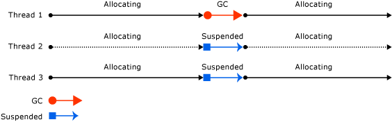

# GC

<!-- TOC -->

- [GC](#gc)
  - [Сборка мусора](#Сборка-мусора)
    - [Условия сборки](#Условия-сборки)
    - [Управляемая куча](#Управляемая-куча)
    - [Поколения](#Поколения)
    - [Ephemeral generations](#ephemeral-generations)
    - [Что происходит](#Что-происходит)
    - [Большие объекты](#Большие-объекты)
    - [Settings](#settings)
    - [Методы GC](#Методы-gc)
  - [Финализаторы](#Финализаторы)
  - [Внешние ресурсы, Dispose](#Внешние-ресурсы-dispose)
    - [IDisposable pattern](#idisposable-pattern)

<!-- /TOC -->

<div style="page-break-after: always;"></div>

## Сборка мусора

[GarbageCollector](https://docs.microsoft.com/en-us/dotnet/standard/garbage-collection/) - автоматический диспетчер памяти

- Не нужно освобождать память самому
- GC сам выделяем память
- GC уничтожает неиспользуемые объекты, плюс очищает память для создаваемых объектов (можно не инициализировать).
- Обеспечивает безопасность памяти, гарантируя, что объект не сможет использовать содержимое другого объекта.

<div style="page-break-after: always;"></div>

### Условия сборки

- Мало памяти в системе
- Память, используемая выделенными объектами в управляемой куче, превышает допустимый порог. Это пороговое значение постоянно корректируется по мере выполнения приложения.
- Непосредственный вызов `GC.Collect()`

### Управляемая куча

- После того, как CLR инициализирует CG он аллоцирует сегмент памяти - управляемую кучу.
- Отдельная managed heap для каждого процесса, потоки обращаются к одной куче
- GC выделяет и освобождает память в ОС по сегментам (через VirtualAlloc/ VirtualFree)

<div style="page-break-after: always;"></div>

### Поколения

Все объекты в куче разделяются по 3 поколениям:

- `Generation 0` - не подвергались сборке мусора, коротко живущие объекты, которые только что создали
  - уборка мусора в поколении 0 занимает меньше 1 мс
- `Generation 1` - пережили одну сборку, такой себе буфер между коротко живущими и долго живущими
- `Generation 2` - пережили больше одной сборки

Если объект выживает после сборки мусора - он переходит в следующее поколение.
CG выполняет сборку в определенном поколении (ну и всех поколениях ниже). Сборка во втором поколении - полная сборка, которая затрагивает все объекты в куче.

<div style="page-break-after: always;"></div>

### Ephemeral generations

Содержит поколения 0-1. Все новые сегменты - эфемерные.

bitness                         |32-bit | 64-bit
------------------------------- | ----- | ------
Workstation GC                  | 16 MB | 256 MB
Server GC                       | 64 MB | 4 GB
Server GC with > 4 logical CPUs | 32 MB | 2 GB
Server GC with > 8 logical CPUs | 16 MB | 1 GB

<div style="page-break-after: always;"></div>

### Что происходит

- Marking phaze
  - сначала объявляет все объекты, как ненужные, потом проходит по всем элементам и находит все живые объекты
  - помечает их битом, что они достижимы из корней приложения
- Relocating phaze = обновляет все необходимые ссылки
- Compacting phaze
  - Объекты внутри Large object heap не перемещаются.

<div style="page-break-after: always;"></div>


<div style="page-break-after: always;"></div>

### Большие объекты

- Для оптимизации большие объекты (>85kb) складываются в отдельную кучу (Large Object Heap)
- сразу хранятся во втором поколении
- не перемещаются (до .net 4.5, [`GCSettings.LargeObjectHeapCompactionMode`](https://msdn.microsoft.com/en-us/library/system.runtime.gcsettings.largeobjectheapcompactionmode(v=vs.110).aspx))
- не лучшая идея делать большие короткоживущие объекты (частая полная сборка мусора)

<div style="page-break-after: always;"></div>

Пример сборки:



- Если GC хочет удалить объект, у которого объявлен финализатор, то он (финализатор) помещается в отдельную очередь на очистку, которая запускается после очистки мусора. Сам объект помечается выжившим и попадает автоматически в следующее поколение. И может быть очищен только при следующей сборке мусора в следующем поколении.
- Если не удалось освободить достаточно памяти, и не удается выделить новый сегмент, то кинется `OutOfMemoryException` (и конечно перед этим выполнится полная сборка мусора)

<div style="page-break-after: always;"></div>

### Settings

На что мы можем [повлиять](https://docs.microsoft.com/en-us/dotnet/standard/garbage-collection/fundamentals#workstation_and_server_garbage_collection)?

- Режим [`<gcServer enabled="true|false"/>`](https://docs.microsoft.com/en-us/dotnet/framework/configure-apps/file-schema/runtime/gcserver-element)
  - Workstation
    - Минимизация приостановки потоков и использования ресурсов!
    - Сборка выполняется в том же потоке, с тем же приоритетом
    - Если процессор один, то только workstation GC (независимо от настройки)
  - Server
    - Можно бросить все силы сервака на сбор хлама!
    - Сборка происходит на множестве выделенных потоков с `THREAD_PRIORITY_HIGHEST`
    - Сборка распараллеливается до числа cpu (Может получиться МНОГО потоков)
    - По-умолчанию сегменты больше
    - Включен по умолчанию для ASP.NET and SQL Server
- [`<gcConcurrent enabled="true|false">`](https://docs.microsoft.com/en-us/dotnet/framework/configure-apps/file-schema/runtime/gcconcurrent-element)
  - Non-concurrent
  - Background (раньше Concurent)
    - включает выполнение сборки мусора в фоне для Generation 2
    - Generation 0-1 всегда выполняются non-concurrent, потому что происходят очень быстро
    - повышает отзывчивость, но ухудшает производительность при многих процессах
    - по-умолчанию Concurrent

<div style="page-break-after: always;"></div>

Server GC:


<div style="page-break-after: always;"></div>

GC Concurrent:


<div style="page-break-after: always;"></div>

GC Background

- Пришел на смену Concurrent, включается автоматически
- Отличается тем, что может выполнять высокоприоритетную сборку Generation0-1, чтобы выделение памяти не прерывалось из-за сборки Generation2 в фоне


<div style="page-break-after: always;"></div>

Gc Server Background


<div style="page-break-after: always;"></div>

### Методы GC

Явного вызова методов GC надо стараться избегать.

```cs
void Collect(Int32 generation, GCCollectionMode mode, Boolean blocking);
// GCCollectionMode:
//      Default: значение по умолчанию для данного перечисления (Forced)
//      Forced: вызывает немедленное выполнение сборки мусора
//      Optimized: позволяет сборщику мусора определить, является ли текущий момент оптимальным для сборки мусора

GC.Collect(1, GCCollectionMode.Optimized);
```

<div style="page-break-after: always;"></div>

```cs
GC.GetGeneration(Object) // Получить поколение для объекта

Int32 CollectionCount(Int32 generation);
Int64 GetTotalMemory(Boolean forceFullCollection);

GC.WaitForPendingFinalizers(); // Приостанавливает выполнение потока до освобождения всех объектов, для которых производится сборка

GC.SuppressFinalize(this); // Подсказывает, что у указанного объекта не должен выполняться финализатор
```

<div style="page-break-after: always;"></div>

## Финализаторы

Очистка unmanaged ресурсов при сборке мусора:

```cs
internal sealed class SomeType
{
    // Метод финализации
    ~SomeType()
    {
        // Код метода финализации
        Win32.DestroyHandle(this.CursorFileBitmapIconServiceHandle);
    }
}
```

<div style="page-break-after: always;"></div>

```cs
protected override void Finalize()
{
    try
    {
        // здесь идут инструкции
    }
    finally
    {
        base.Finalize();
    }
}
```

<div style="page-break-after: always;"></div>

- поскольку в финализаторе можно обращаться к полям - мы не можем удалить объект и перемещаем его в след. поколение, все зависимые объекты тоже будут помечены как досягаемые
- нельзя перехватить необработанное исключение из финализатора
- выполняется в отдельном высокоприоритетном потоке
- порядок вызова финализаторов никак не определен
- финализатор вызовется даже для не полностью инициализированного объекта

- надо использовать финализаторы только там, где необходимо
- замедляют сборку мусора
- недетерменированы

<div style="page-break-after: always;"></div>

## Внешние ресурсы, Dispose

Для явного освобождения внешних ресурсов, используется интерфейс [`IDisposable`](https://msdn.microsoft.com/en-us/library/system.idisposable(v=vs.110).aspx)
[MSDN](https://docs.microsoft.com/ru-ru/dotnet/standard/garbage-collection/unmanaged)

```cs
public interface IDisposable
{
    void Dispose();
}
```

<div style="page-break-after: always;"></div>

Пример:

```cs
Byte[] bytesToWrite = new Byte[] { 1, 2, 3, 4, 5 };
FileStream fs = new FileStream("Temp.dat", FileMode.Create); // Создание временного файла
fs.Write(bytesToWrite, 0, bytesToWrite.Length); // Запись байтов во временный файл
File.Delete("Temp.dat"); // Генерируется исключение IOException
```

```cs
FileStream fs = new FileStream("Temp.dat", FileMode.Create);
fs.Write(bytesToWrite, 0, bytesToWrite.Length);
fs.Dispose();
File.Delete("Temp.dat");
```

<div style="page-break-after: always;"></div>

```cs
FileStream fs = new FileStream("Temp.dat", FileMode.Create);
try
{
    fs.Write(bytesToWrite, 0, bytesToWrite.Length);
}
finally
{
    if (fs != null)
        fs.Dispose();
}
File.Delete("Temp.dat");
```

```cs
using (FileStream fs = new FileStream("Temp.dat", FileMode.Create))
{
    fs.Write(bytesToWrite, 0, bytesToWrite.Length);
}
File.Delete("Temp.dat");
```

<div style="page-break-after: always;"></div>

Типичное общение с базой данных:

```cs
public License LicenseLoad(Guid licenseId)
{
    using (var db = new Data(_connection) { RetryPolicy = _retryPolicy })
    {
        return db.Licenses.SingleOrDefault(x => x.Id == licenseId);
    }
}
```

- Надо иметь в виду, что если падает констуктор инициализации объекта, то метод Dispose вызван не будет.

<div style="page-break-after: always;"></div>

### IDisposable pattern

[MSDN](https://docs.microsoft.com/en-us/dotnet/standard/design-guidelines/dispose-pattern) статья о паттерне, [MSDN 2](https://docs.microsoft.com/en-us/dotnet/standard/garbage-collection/implementing-dispose), [Тепляков 3](https://habrahabr.ru/post/129283/), [SOF 4](https://stackoverflow.com/questions/538060/proper-use-of-the-idisposable-interface)

Есть 2 типа ресурсов:

- managed
  - ресурс, упакованный в объект, который уже реализует метод `Dispose`
- unmanaged
  - intPtr, Socket, etc

MSDN предлагает две версии паттерна, базовую и с финализатором (если объект содержит unmanaged ресурс).

<div style="page-break-after: always;"></div>

```cs
public class DisposableResourceHolder : IDisposable
{
    private SafeHandle resource; // handle to a resource

    public DisposableResourceHolder()
    {
        this.resource = ... // allocates the resource
    }
    public void Dispose()
    {
        Dispose(true);
        GC.SuppressFinalize(this);
    }
    protected virtual void Dispose(bool disposing)
    {
        if (disposing)
        {
            if (resource!= null) resource.Dispose();
        }
    }
}
```

<div style="page-break-after: always;"></div>

```cs
public class ComplexResourceHolder : IDisposable
{
    private IntPtr buffer; // unmanaged memory buffer
    private SafeHandle resource; // disposable handle to a resource

    private bool disposed = false; // Уже удален или еще нет

    public void Dispose()
    {
        Dispose(true);
        GC.SuppressFinalize(this);
    }

    ~ ComplexResourceHolder()
    {
        Dispose(false);
    }

    protected virtual void Dispose(bool disposing)
    {
        if (disposed)
            return;

        ReleaseBuffer(buffer); // release unmanaged memory

        if (disposing)
        {
            // release other disposable objects Here
            if (resource!= null)
                resource.Dispose();
        }
    }
}
```

<div style="page-break-after: always;"></div>

Сложноватый паттерн? Попроще нельзя? Зачем вообще это?

1. Класс, содержащий управляемые или неуправляемые ресурсы реализует интерфейс `IDisposable`.
1. Класс содержит `Dispose(bool disposing)`.
- true - вызывается из метода Dispose
- false - вызывается из финализатора
- Должен быть private для sealed классов, иначе protected virtual

```cs
// Для не-sealed классов
protected virtual void Dispose(bool disposing) {}

// Для sealed классов
private void Dispose(bool disposing) {}
```

<div style="page-break-after: always;"></div>

3. Сам метод Dispose сначала очищает ресурсы, потом вызывает SuppressFinalize

```cs
public void Dispose()
{
  Dispose(true /*called by user directly*/);
  GC.SuppressFinalize(this); // Порядок важен
}
```

4. Метод Dispose(bool disposing) в зависимости от флага, при вызове из финализатора уничтожает только unmanaged ресурсы

```cs
void Dispose(bool disposing)
{
    if (disposing)
    {
        // Освобождаем только управляемые ресурсы
    }
    // Освобождаем неуправляемые ресурсы
}
```

<div style="page-break-after: always;"></div>

5. [Опционально] Класс может содержать финализатор

```cs
~ComplexResourceHolder()
{
    Dispose(false /*not called by user directly*/);
}
```

6. [Опционально] Класс может содержать поле `bool disposed`

```cs
void Dispose(bool disposing)
{
    if (disposed) { return; } // Ресурсы уже освобождены
    // Освобождаем ресурсы
    disposed = true;
}
public void SomeMethod()
{
    if (disposed)
        throw new ObjectDisposedException();
}
```

<div style="page-break-after: always;"></div>

7. [Опционально] Класс может унаследоваться от `CriticalFinalizerObject`

- компилируется JIT при создании объекта (а не при освобождении)
- заставляет такие классы освобождаться позднее, чем обычные
- финализатор будет вызван при экстренной выгрузке домена приложений

```cs
class Foo : CriticalFinalizerObject {}
```

<div style="page-break-after: always;"></div>

- Обычно в таком тяжелом паттерне нет нужды
- Обертку над unmanaged объектом надо выносить в отдельный класс и не смешивать с бизнес логикой.
- таким образом bool по большому счету будет не нужен

```cs
class SomethingWithManagedResources : IDisposable
{
    public void Dispose()
    {
        // Никаких Dispose(true) и никаких вызовов GC.SuppressFinalize()
        DisposeManagedResources();
    }

    // Никаких параметров, этот метод должен освобождать только управляемые ресурсы
    protected virtual void DisposeManagedResources() {}
}
```

<div style="page-break-after: always;"></div>

Самый упрощенный вариант :)
Типа, если класс sealed, то зачем нам отдельный метод:

```cs
sealed class SomethingWithManagedResources : IDisposable
{
    public void Dispose()
    {
        handle.Dispose();
    }
}
```