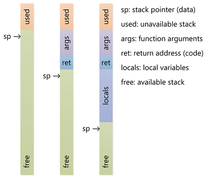
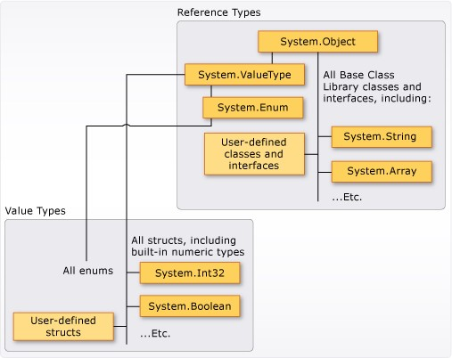
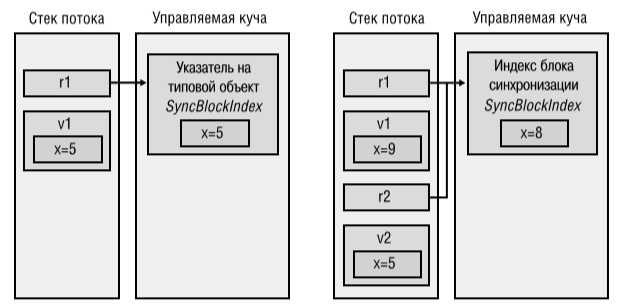

# Types

<!-- TOC -->

- [Types](#types)
  - [Namespaces](#namespaces)
  - [Primitive types](#primitive-types)
    - [Integers](#integers)
    - [Float numbers](#float-numbers)
    - [Other common types](#other-common-types)
  - [Инициализация](#Инициализация)
    - [Неявная типизация](#Неявная-типизация)
  - [Операторы](#Операторы)
    - [Арифметические](#Арифметические)
    - [Поразрядные](#Поразрядные)
    - [Операторы с присваиванием](#Операторы-с-присваиванием)
    - [Логические операторы](#Логические-операторы)
    - [Ternary operator](#ternary-operator)
    - [Null coalescing operator](#null-coalescing-operator)
    - [Null conditional operator](#null-conditional-operator)
  - [Контроль переполнения](#Контроль-переполнения)
  - [Приведение типов](#Приведение-типов)
  - [Ссылочные и значимые типы](#Ссылочные-и-значимые-типы)
    - [Stack & Heap](#stack--heap)
    - [Referenced VS Value types](#referenced-vs-value-types)
    - [Передача параметров (TODO)](#Передача-параметров-todo)
    - [System.Object](#systemobject)
    - [Boxing / Unboxing (TODO)](#boxing--unboxing-todo)

<!-- /TOC -->

<div style="page-break-after: always;"></div>

## Namespaces

Пространства имен нужны для логической группировки родственных типов.
Делают имя класса уникальным для компилятора.
Например, `System.Int32`, `System.Collections.Generic.List`.

`using` - директива заставляет компилятор добавлять этот префикс к классам, пока не найдет нужный класс.

В коде можно писать имя класса без namespace.

```cs
using System.IO; // Здесь собранны InputOtput классы для работы с файловой системой, потоками
using System.Collections; // Все готовые коллекции
using System.Collections.Generic; // Обобщенные коллекции
using System.Linq; // Набор хелперов для генерации LINQ запросов
using Newtonsoft.Json; // Подключили сторонюю библиотеку
using Abbyy.Shared.Library; // Подключили свою отдельную библиотеку

...
var list = new List<int>();

```

<div style="page-break-after: always;"></div>

Пространства имен и сборки могут не быть связаны друг с другом.

Типы одного пространства имен могут быть реализованы разными сборками.

Чтобы обезапасить от конфликтов имен рекомендуется использовать namespace,
начинающийся с имени компании, потом название системы/подсистемы.

Если в двух namespace содержатся одинаковые классы, то:

- либо надо указывать полное имя класса с namespace
- либо можно, используя директиву `using`, задать alias для класса

```cs
using System.Windows.Forms;
using myButton = Abbyy.Shared.Controls.Button; // Добавляем alias для класса

...
var button = new myButton();
var button = new Abbyy.Shared.Controls.Button();
```

<div style="page-break-after: always;"></div>

## Primitive types

### Integers

| Type          | Alias     | Size   | Explanation                                   |
| ------------- | --------- | ------ | --------------------------------------------- |
| System.Byte   | **byte**  | 1 byte | unsigned `0` to `255`                         |
| System.SByte  | sbyte     | 1 byte | signed  `-128` до `127`                       |
| System.Int16  | **short** | 2 byte | signed `±32,767`                              |
| System.UInt16 | ushort    | 2 byte | unsigned  `0` до `65 535`                     |
| System.Int32  | **int**   | 4 byte | signed `± 2 147 483 647`                      |
| System.UInt32 | uint      | 4 byte | unsigned  `0` до `4 294 967 295`              |
| System.Int64  | **long**  | 8 byte | signed `± 9 223 372 036 854 775 807`          |
| System.UInt64 | ulong     | 8 byte | unsigned  `0` до `18 446 744 073 709 551 615` |

Не рекомендуется использовать sbyte / uint / ushort / ulong как не CLS совместимые.

Помимо этого:

- Многие стандартные методы возвращают обычные типы (получится дополнительная конвертация).
- Если не хватает размера, то увеличение в 2 раза не решает проблему.

Короче, используйте int, long, short, byte.

<div style="page-break-after: always;"></div>

### Float numbers

| Type           | Alias              | Size   | Explanation                            | base | mantissa | exponent | precision digits |
| -------------- | ------------------ | ------ | -------------------------------------- |----- | -------- | -------- | ---------------- |
| System.Single  | [float][float-url] | 4 byte | [Single-precision][single-pre] floating-point  ±3.4*10^38 |2  | 23  | 8   | 7          |
| System.Double  | double             | 8 byte | Double-precision floating point ±1.7*10^308 |2    | 52   | 11       | 15-16            |
| System.Decimal | [decimal][decimal-url] | 16 byte | decimal number ±7.9*10^28         | 10   | 96       | 5 (0-28) | 28-29            |

[decimal-url]:https://docs.microsoft.com/en-us/dotnet/csharp/language-reference/keywords/decimal
[float-url]:https://docs.microsoft.com/en-us/dotnet/csharp/language-reference/keywords/float
[single-pre]:https://en.wikipedia.org/wiki/Single-precision_floating-point_format

decimal - десятичное число с плавающей запятой, это не примитивный тип и работает сильно медленее double (до 20 раз).

Основное различие можно понять на примере:

```cs
double a = 0.1;
double b = 0.2;
Console.WriteLine(a + b == 0.3); // false

decimal c = 0.1M;
decimal d = 0.2M;
Console.WriteLine(c + d == 0.3M); // true
```

`decimal` используется для валют и чисел, которые исконно "десятичные" (CAD, engineering, etc).

Не надо сравнивать double через `==`.
У double есть зарезервированные значения `double.NaN`, `double.Epsilon`, `double.Infinity`.

<div style="page-break-after: always;"></div>

### Other common types

| Type                    | Alias     | Size               | Explanation         |
| ----------------------- | ----------| -------------------| --------------------|
| System.Boolean          | bool      | [1 byte][bool-url] | true / false        |
| System.Char             | char      | 2 byte             | Single unicode char |
| System.String           | string    | потом              | Sequence of char    |
| System.Object           | object    | потом              | Base Type           |
| [System.Guid][guid-url] |           | 16 byte            | Unique identifier   |
| System.DateTime         |           | 8 byte             | Date and time       |

[bool-url]:https://stackoverflow.com/questions/2308034/primitive-boolean-size-in-c-sharp
[guid-url]:https://msdn.microsoft.com/en-us/library/system.guid(v=vs.110).aspx

`bool` хоть и содержит информации на 1 бит хранится в байте.
При особом желании можно упаковать его для использования в массиве, скажем с помощью классов `BitVector32`, `BitArray`,
но заниматься подобными извращениями надо в исключительных ситуациях.

`Guid`, `DateTime` не являются примитивными.

<div style="page-break-after: always;"></div>

## Инициализация

```cs
<datatype> <variable name>;
<datatype> <variable name> = <value>;
```

```cs
int x;
System.Int32 x = new System.Int32(); // Эквивалент предыдущей строки, подробнее про new позднее
int t = 0x1D;        // шестнадцатиричное представление 29

bool isValid = true;

double y = 3.0;      // По-дефолту число с точкой считается компилятором как double
float f = 33.1f;     // Используем суфикс, чтобы студия не считала его double
decimal d = 11.1m;   // m для decimal

char c = 's';
string s = "Hello!"; // Разные кавычки

int z = x + 5;       // Сразу присваиваем
int i, j, k, l = 0;  // Много переменных сразу УИИИХУ, ниразу не видел такого в реальном коде
```

<div style="page-break-after: always;"></div>

### Неявная типизация

Компилятор сам понимает, какой тип.

```cs
var x = 1;
var y = null; // Нельзя
```

[Microsoft C# coding convensions](https://docs.microsoft.com/en-us/dotnet/csharp/programming-guide/inside-a-program/coding-conventions) var usage:

```cs
// Используйте неявную типизацию для локальных переменных, когда тип элементарно понимается из правого выражения или не важен
var x = new MyClass();
var i = 3;
var list = new List<int>();
var db = new Data(_connection) { RetryPolicy = _retryPolicy };

// Не используете var, если тип не очевиден из правой части
var ExampleClass.ResultSoFar();
var ticketLifeTime = getTicketLifeTime(licenses);
var newCounters = mergeResult
    .Where(x => x.LicenseId == license.Id)
    .ToDictionary(x => x.Name, y => y.Value); // Дискуссионно, потому что итоговый тип может быть громоздким и будет отвлекать внимание от основного кода

// Используйте в циклах
foreach (var element in myList)
{
}
```

<div style="page-break-after: always;"></div>

## Операторы

[MSDN Операторы](https://docs.microsoft.com/ru-ru/dotnet/csharp/programming-guide/statements-expressions-operators/operators)

### Арифметические

- Бинарные
  - `+` - сложение `int x = 5 + 7;`
  - `-` - вычитание
  - `/` - деление. Надо иметь в виду, что деление двух целых чисел вернет результат округленный до целого числа
  - `*` - умножение
  - `%` - остаток от деления
- Унарные
  - `++` Инкремент
  - `--` Декремент

У инкремента, декремента выше приоритет, чем у операций умножения, сложения, остатка.

```cs
int x = 2;
int y = ++x; // префиксная форма
Console.WriteLine($"{y} - {x}"); // y=3; x=3

int a = 2;
int b = a++; // постфиксная
Console.WriteLine($"{b} - {a}"); // b=2; a=3
```

<div style="page-break-after: always;"></div>

### Поразрядные

Поразрядные операции над двоичной формой числа:

- `&` И
- `|` ИЛИ
- `^` исключающее ИЛИ / XOR
- `~` инверсия
- `x<<y` / `x>>y` сдвигает число `x` на `y` разрядов

<div style="page-break-after: always;"></div>

### Операторы с присваиванием

 `+=`, `-=`, `^=`, и все остальные варианты

 ```cs
x = x + y;

x += y; // Записи эквиваленты
 ```

 Не используйте такие операторы, они ухудшают читаемость кода

<div style="page-break-after: always;"></div>

### Логические операторы

Логические операторы возвращают bool

- `|`, `&` - логическое ИЛИ / И
- `||` / `&&` - оптимизированные операции ИЛИ / И
  второе условие вычисляется, если первое прошло проверку
- `!` - логическое отрицание
- `^` - исключающие ИЛИ

+ `==` равенство `if (a == b)`
+ `!=` неравенство

Всегда используйте операторы || и && вместо | и &.

Они и быстре и позволяют делать проверки, которые невозможны при одновременном вычислении обоих полей логического оператора

```cs
if ((myObj != null) && (myObj.A == 1))
{
}
```

<div style="page-break-after: always;"></div>

### Ternary operator

Тернарный оператор `?:` по bool условию возвращает левое или правое значение. [SOF Examples of usage](https://stackoverflow.com/questions/3312786/benefits-of-using-the-conditional-ternary-operator)

`result = condition ? left : right`

```cs
// Аналог
if (condition)
    result = left;
else
    result = right;

// Лучше всего использовать для присвоения / возврата простых значений
int result = Check() ? 1 : 0;

// Использование в качестве параметра метода
someMethod((sampleCondition) ? 3 : 1);

int ticketLifetime = licenses.Any()
    ? licenses.Select(x => x.TicketExpiration).Min()
    : TicketMinutesLifetime;

// Можно делать вложенные, но не стоит увлекаться, делает код нечитаемым.
int x = 1, y = 2;
string result = x > y
    ? "x > y"
    : x < y
        ? "x < y"
        : x == y
            ? "x = y"
            : "lul";
```

<div style="page-break-after: always;"></div>

### Null coalescing operator

[Null-coalescing](https://docs.microsoft.com/en-us/dotnet/csharp/language-reference/operators/null-conditional-operator) `??` оператор возвращает левый объект, если он не равен null, иначе возвращает правый.

`result = left ?? right;`

Можно складывать в цепочку.

 ```cs
 int x = param1 ?? localDefault;
 string anybody = getValue() ?? localDefault ?? globalDefault;
 ```

 [SOF Discussion](https://stackoverflow.com/questions/278703/unique-ways-to-use-the-null-coalescing-operator)

<div style="page-break-after: always;"></div>

### Null conditional operator

 [null-conditional operator](https://docs.microsoft.com/en-us/dotnet/csharp/language-reference/operators/null-conditional-operators) `?.` проверяет на null до доступа к полю/свойству/индексу обьекта, и если объект null, то возвращает null, иначе возвращает член объекта.

 Позволяет убрать некоторое количество проверок объектов на null / упростить использование тернарного оператора

```cs
int? length = customers?.Length; // null if customers is null

// Вместо примерно такого кода
int? length = customers == null ? (int?) null : customers.Length;
// или такого
if (customers == null)
    length = null;
else
    length = customers.Length;

Customer first = customers?[0];  // Доступ к индексу
int? count = customers?[0]?.Orders?.Count();  // Множественный сложный вариант
```

<div style="page-break-after: always;"></div>

## Контроль переполнения

По-умолчанию проверка переполнения **выключена**. Код выполняется быстрее.

Операторы `checked`/`unchecked`

```cs
byte a = 100;
byte b = checked((Byte) (a + 200));  // OverflowException
byte c = (Byte)checked(a + 200);   // b содержит 44, потому что сначала сложение конвертируется к Int32, потом проверяется, а потом кастуется к byte

checked
{
    // Начало проверяемого блока
    Byte d = 100;
    b = (Byte) (d + 200);
}
```

Decimal не примитивный тип. `checked / unchecked` для него не работают. Кидает `OverflowException`.

Рихтер рекомендует в процессе разработки ставить флаг компилятору `checked+`, чтобы проверка по-дефолту была включена всегда, программист уже руками расставляет `cheched / unchecked`, где нужно. А при релизе убрать этот флаг компилятора.

<div style="page-break-after: always;"></div>

## Приведение типов

CLR гарантирует безопасность типов.
Всегда можно получить `.GetType()`, который нельзя переопределить.
В C# разрешено неявное безопасное приведение к базовому типу:

```cs
int i = 1;
object a = i;
```

А так же расширяющие безопасные приведения базовых типов:

> byte > short > int > long > decimal
> int > double
> short > float > double

Для приведения к производному типу или в небезопасных  нужно явное приведение:

```cs
int b = (int) a;
```

<div style="page-break-after: always;"></div>

**_IS_** - проверяет совместимость с типом, возвращает bool, никогда не генерирует исключение.

```cs
object a = new object();
bool b = a is object; // true
bool b2 = a is int; // false
```

По факту CLR приходится 2 раза производить проверку типов при использовании `is`. Поэтому сделали:

**_AS_** - проверяет совместимость и если можно, то приводит к заданному типу и возвращает его. Иначе возвращает null

```cs
decimal a = o as decimal;
if (a != null)
{
// Используем a внутри инструкции if
}
```

Отличается от явного приведения только тем, что не генерит исключение.

<div style="page-break-after: always;"></div>

## Ссылочные и значимые типы

### Stack & Heap

Есть Stack (стэк) и есть Heap (управляемая куча) (Ваш КЭП - Вы кстати должны знать эту тему лучше лектора)
Обычно OS выделяет одну кучу на приложение (но можно сделать несколько).
На каждый поток (thread) OS создает свой выделенный стэк (в винде по-умолчанию 1Mb). И то и другое живет в RAM.

Куча менеджерится clr.

Стэк намного быстрее из-за более простого управления хранением объектов, плюс cpu имеет регистры для работы со стеком и помещает частодоступные объекты из стека в кэш. Стек представляет собой LastInFirstOutput очередь. Размер стека конечен, его нельзя расширить и в него нельзя пихать большие объекты. Примерная его работа понятна по картинке:



[SOF explanation stack & heap](https://stackoverflow.com/questions/79923/what-and-where-are-the-stack-and-heap?rq=1)

<div style="page-break-after: always;"></div>

CLR сама решает, где хранить объекты в стеке или куче, у программиста нет прямой возможности управлять этим.

Это базовое отличие от С++.

Конечно, программист может с помощью выбора типов и того, как он их использует, влиять на то, как clr обращается с объектами, но все равно это получается достаточно ограничено.

<div style="page-break-after: always;"></div>

### Referenced VS Value types

Все объекты в C# делятся на 2 типа: [Value types](https://docs.microsoft.com/ru-ru/dotnet/csharp/language-reference/keywords/value-types) и [Referenced types](https://docs.microsoft.com/ru-ru/dotnet/csharp/language-reference/keywords/reference-types) (Значимые и ссылочные типы).

**Ссылочные** типы всегда хранятся в куче, в стеке помещается указатель на объект в куче (поэтому и Reference).

**Значимые** типы **могут** храниться в стеке, как локальные переменные.

Значимые типы, сохраненные в стеке, «легче» ссылочных: для них не нужно выделять память в управляемой куче, их не затрагивает сборка мусора, к ним нельзя обратиться через указатель.

Value Types (структуры и перечисления):

- **enum**
- **struct**
  - bool
  - byte / short / int / long
  - decimal
  - char
  - float / double

Reference Types (классы):

- object
- **class**
  - string

Все классы - ссылочные типы (в том числе всякие делегаты, интерфейсы, массивы и пр).
Все структуры и перечисления (enum) - значимые (базовые типы - это тоже структуры).

<div style="page-break-after: always;"></div>

Разделение по классам:



- [System.ValueType](https://msdn.microsoft.com/en-us/library/system.valuetype(v=vs.110).aspx)
  - наследник oject, переопределяет его методы
  - базовый класс для всех значимых типов
  - нельзя создать его наследника напрямую
  - сам он является ссылочным, но все его реалзиации - значимые
- System.Enum - базовый тип для всех пользовательских перечислений

<div style="page-break-after: always;"></div>

Рассмотрим на примере кода:

```cs
class SomeRef { public Int32 x; } // Ссылочный тип
struct SomeVal { public Int32 x; } // Значимый тип

static void ValueTypeDemo()
{
    SomeRef r1 = new SomeRef(); // Размещается в куче
    SomeVal v1 = new SomeVal(); // Размещается в стеке
    r1.x = 5; // Разыменовывание указателя, изменение в куче
    v1.x = 5; // Изменение в стеке

    SomeRef r2 = r1; // Копируется только ссылка (указатель)
    SomeVal v2 = v1; // Помещаем в стек и копируем члены
    r1.x = 8; // Изменяются r1.x и r2.x
    v1.x = 9; // Изменяется v1.x, но не v2.x
    Console.WriteLine($"{r1.x}, {r2.x}, {v1.x}, {v2.x} "); // "8,8,9,5"
}
```



<div style="page-break-after: always;"></div>

Почитать:

- [Heap vs steak in C#](http://www.c-sharpcorner.com/article/C-Sharp-heaping-vs-stacking-in-net-part-i/)
- [Value Types stored, Eric Lippert](https://blogs.msdn.microsoft.com/ericlippert/2010/09/30/the-truth-about-value-types/)

<div style="page-break-after: always;"></div>

### Передача параметров (TODO)

### System.Object

Все классы неявно наследуются от object ([System.Object](https://msdn.microsoft.com/ru-ru/library/system.object(v=vs.110).aspx))
Общие методы:

- Public
  - ToString `*` - строковое представление экземпляра объекта, по дефолту `this.GetType().FullName()`
  - GetType - получить тип объекта
  - GetHashCode `*` - хэш-код для хранения в качестве ключа хэш-таблиц
  - Equals `*` - true, если объекты равны
- Protected
  - MemberwiseClone - создает новый экземпляр и присваивает все поля исходного объекта (без вложенных классов)
  - Finalize `*` - используется для очистки ресурсов, вызывается, когда сборщик мусора пометил объект для удаления, но до освобождения памяти

`*` - Методы, которые можно переопределить в своих классах

### Boxing / Unboxing (TODO)