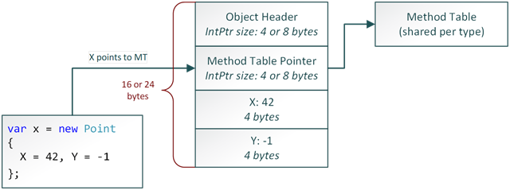

# Classes

<!-- TOC -->

- [Classes](#classes)
  - [Конструкторы](#конструкторы)
  - [Модификаторы доступа](#модификаторы-доступа)
  - [readonly](#readonly)
  - [static](#static)
    - [static field](#static-field)
    - [static метод](#static-метод)
    - [static class](#static-class)
    - [static конструктор](#static-конструктор)
  - [partial](#partial)
  - [Наследование, полиморфизм, интерфейсы](#наследование-полиморфизм-интерфейсы)
    - [abstract](#abstract)
    - [sealed](#sealed)
  - [Перегрузка методов, операторов](#перегрузка-методов-операторов)
  - [Аттрибуты](#аттрибуты)
  - [Generic типы и методы, constraint](#generic-типы-и-методы-constraint)
  - [Анонимные типы, dynamic](#анонимные-типы-dynamic)
  - [Extension methods](#extension-methods)
  - [Сборка мусора](#сборка-мусора)
    - [Алгоритм, GC](#алгоритм-gc)
    - [Финализаторы](#финализаторы)
    - [Внешние ресурсы, IDisposable pattern](#внешние-ресурсы-idisposable-pattern)

<!-- /TOC -->

```cs
using System;
internal class SomeType
{
    private class SomeNestedType { }    // Вложенный класс

    private int _someValue = 1;

    public SomeType(Int32 x) { }        // Конструкторы экземпляров

    protected String Method() { return null; } // Method
    public Int32 SomeProp { get;set;}  // Property
}
```

## Конструкторы

Все объекты создаются оператором `new`.

```cs
SomeType e = new SomeType(4);
SomeType e = new SomeType(3) { SomeProp = 5}; // Инициализатор

e.SomeProp = 5  // Идентично
```

- Вычесляет количество необходимой памяти для экземпляра
- Выделяет память в куче, заполняя нулями
- Инициализирует указатель на объект
- Вызывает конструктор с параметрами
- Возвращает ссылку на созданный объект

<div style="page-break-after: always;"></div>

У каждого managed объекта есть некоторый overhead:



- object header - used by clr
- “Why the managed object’s layout is so weird?”, is simple: “historical reasons” [MSDN blog post](https://blogs.msdn.microsoft.com/seteplia/2017/05/26/managed-object-internals-part-1-layout/)

<div style="page-break-after: always;"></div>

Есть ключевое слово `this` для доступа к полям экземпляра

```cs
internal class SomeType
{
    private int _value;

    public SomeType(Int32 x)
    {
        _value = x;
        this._value = x; // Ключевое слово this
    }
}
```

## Модификаторы доступа

Определяют видимость элемента

- `public` - доступен в любых сборках
- `internal` - только в текущей сборке
- `private` - только в данном классе
- `protected` - в классе и его наследниках
- `protected internal` - в классе и его наследниках из данной сборки

Можно определить сборку [дружественной](https://msdn.microsoft.com/en-us/library/0tke9fxk(v=vs.100).aspx), чтобы internal можно было использовать в другой сборке.

- По-умолчанию, если не указать будет private
- Проверку доступа производит как базовый компилятор, так и JIT компилятор
- При наследовании от базового класса CLR позволяет снижать, но не повышать ограничения доступа к члену.

## readonly

Поле класса, помеченное `readonly` может быть изменено только в конструкторе

```cs
internal class SomeType
{
    private readonly int _value;

    public SomeType(Int x)
    {
        _value = x;
    }

    public void Set(int x)
    {
        _value = x; // Нельзя, компилятор будет ругаться
    }
}
```

## static

Указывает что данный элемент относится не к конкретному экземляру, а к типу в целом.

### static field

Все экземпляры класса будут обращаться к единому статичному полю

```cs
public class My
{
    public static string T = 10; // Все экземпляры My будут обращаться к одному T
}

var m = new My();
var m2 = new My();
m2.T = 11;
// m.T тоже = 11
```

### static метод

Метод не относится к экземляру, а к типу в целом.
Может использовать внутри себя только статические поля класса

```cs
public class My
{
    public static string Method(int x) {}
}

string result = My.Method(3);
```

### static class

В классе можно объявлять только статические члены.
Используется для написания хелперов с общей логикой без состояния.

```cs
public static class MyHelper
{
    public static string EncodeObject<T>(T value) {...}
}

string result = MyHelper.Encode(myValue);
```

### static конструктор

Статический конструктор используется для инициализации статических полей класса

- Вызывается в **неопределенный** момент времени до использования. В clr реализовано, что он непосредственно вызывается перед первым использованием класса. Повлиять на это никак нельзя.
- Ему нельзя задавать модификатор доступа
- Ему нельзя передавать параметры

```cs
public static class MyHelper
{
    public static readonly string Format;

    static MyHelper()
    {
        Format = Configuration.Format;
    }

    public static string EncodeObject<T>(T value) {...}
}
```

Рекомендации:

- Не используйте статические классы, кроме сценариев хелперов
- Они ломают тестируемость и модульность приложения
- Они не ложатся в концепции di
- Они создают зависимости, которыми очень сложно управлять и неочевидно как отлаживать
- Не используйте статические конструкторы

## partial

Частичные классы. `partial` позволяет создавать класс, расположенный в нескольких файлах, которые компилятор соединит в один

```cs
public parital MyClass
{
    public string MethodA() {}
}
```

```cs
public parital MyClass
{
    public string MethodB() {}
}
```

## Наследование, полиморфизм, интерфейсы

### abstract

### sealed

## Перегрузка методов, операторов

## Аттрибуты

## Generic типы и методы, constraint

## Анонимные типы, dynamic

## Extension methods

## Сборка мусора

### Алгоритм, GC

### Финализаторы

### Внешние ресурсы, IDisposable pattern
