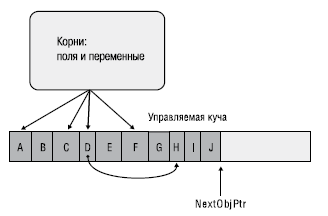
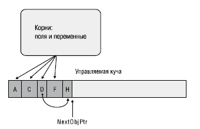
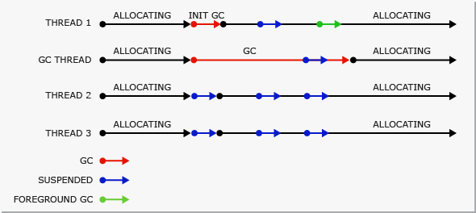
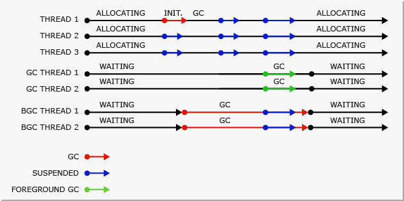

# Classes

<!-- TOC -->

- [Classes](#classes)
  - [Members](#members)
  - [Модификаторы доступа](#Модификаторы-доступа)
  - [Конструкторы](#Конструкторы)
  - [Methods](#methods)
  - [Properties](#properties)
  - [`readonly`](#readonly)
  - [`const`](#const)
  - [`static`](#static)
    - [`static` member](#static-member)
    - [`static` class](#static-class)
    - [`static` конструктор](#static-конструктор)
  - [`partial`](#partial)
  - [Наследование, полиморфизм](#Наследование-полиморфизм)
    - [`sealed`](#sealed)
    - [`abstract`](#abstract)
  - [Interface](#interface)
  - [Перегрузка операторов](#Перегрузка-операторов)
    - [Перегрузка преобразований типов](#Перегрузка-преобразований-типов)
  - [Extension methods](#extension-methods)
  - [Аттрибуты](#Аттрибуты)

<!-- /TOC -->

<div style="page-break-after: always;"></div>

## Members

[Члены класса](https://docs.microsoft.com/en-us/dotnet/csharp/programming-guide/classes-and-structs/members)

```cs
using System;
internal class SomeType
{
    private class SomeNestedType { }    // Nested Type

    private int _x = 1;                 // Field
    private SomeNestedType Value;       // --

    internal SomeType(Int32 x) { }      // Конструкторы экземпляров

    internal protected void Method() {} // Method
    internal int Property { get;set;}   // Property
}
```

<div style="page-break-after: always;"></div>

## Модификаторы доступа

Определяют видимость элемента

- `public` - доступен в любых сборках
- `internal` - только в текущей сборке
- `private` - только в данном классе
- `protected` - в классе и его наследниках
- `protected internal` - в классе и его наследниках из данной сборки

Можно определить сборку [дружественной](https://msdn.microsoft.com/en-us/library/0tke9fxk(v=vs.100).aspx), чтобы internal можно было использовать в другой сборке.

- По-умолчанию, если не указать будет private
- Проверку доступа производит как базовый компилятор, так и JIT компилятор
- При наследовании от базового класса CLR позволяет снижать, но не повышать ограничения доступа к члену.

<div style="page-break-after: always;"></div>

## Конструкторы

Все объекты создаются оператором `new`.

```cs
SomeType e = new SomeType(4);
SomeType e = new SomeType(3) { SomeProp = 5 }; // Инициализатор

e.SomeProp = 5  // Идентично
```

- Вычесляет количество необходимой памяти для экземпляра
- Выделяет память в куче, заполняя нулями
- Инициализирует указатель на объект
- Вызывает конструктор с параметрами
- Возвращает ссылку на созданный объект

<div style="page-break-after: always;"></div>

У каждого managed объекта есть некоторый overhead:


- object header - used by clr
- “Why the managed object’s layout is so weird?”, is simple: “historical reasons” [MSDN blog post](https://blogs.msdn.microsoft.com/seteplia/2017/05/26/managed-object-internals-part-1-layout/)

<div style="page-break-after: always;"></div>

- Конструкторы позволяют инициализировать объект
- Есть ключевое слово `this` для доступа к полям экземпляра
- Конструкторы не наследуются
- Если конструктор не указать, компилятор создаст пустой конструктор без параметров автоматически.

```cs
public class SomeType {  public SomeType() }
public class SomeType {  public SomeType() : base() { } }
```

```cs
internal class SomeType
{
    private int _value;

    internal SomeType(int x)
    {
        _value = x;
        this._value = x; // Ключевое слово this
    }
}

var value = new SomeType(x);
```

<div style="page-break-after: always;"></div>

Еще пример с инициализатором:

```cs
internal class SomeType
{
    internal int Value;
}
// Инициализируем
var value = new SomeType();
value.Value = 10;
// Эквивалент через инициализатор
var value = new SomeType { Value = 10 };
```

Если указать в классе поля со значениями, то компилятор по сути добавит инициализацию этого метода в цепочку вызова конструкторов:

```cs
internal class SomeType
{
    internal int Value = 10;
    public SomeType() {}
}
```

<div style="page-break-after: always;"></div>

## Methods

```cs
public class Example
{
    public int Add(int x, int y)
    {
        return x + y;
    }

    public void Print(int x)
    {
        Console.WriteLine(x);
    }

    // Expression-bodied method
    // без return
    // для методов/конструкторов/property содержащих одно выражение
    public void NewPrint(int x) => Console.WriteLine(x);
}
```

<div style="page-break-after: always;"></div>

Необязательные параметры:

- Значения по умолчанию
  - идут после остальных параметров
  - определяются на этапе компиляции, поэтому либо примитивные типы, либо такие значения как `null`, `default`, `new(...)`
  - не задаются для `ref` / `out` параметров

```cs
public static int Method(int x, int y=0, int z=0,
    String s = "A", DateTime dt = default(DateTime), Guid guid = new Guid())
{
    return x + y + z;
}

int i = Method(5);
int u = Method(5, z:4); // Именованный параметр
```

<div style="page-break-after: always;"></div>

Перегрузка методов:

```cs
public class Example
{
    public void Test(int a)
    {
        Console.WriteLine($"{a}");
    }
    public void Test(int a, int b)
    {
        Console.WriteLine($"{a} {b}");
    }
    public int Test(int a, int b, int c)
    {
        Console.WriteLine($"{a} {b} {c}");
        return a + b + c;
    }
    public void Test(double a, double b)
    {
        Console.WriteLine($"{a} {b}");
    }
}
```

<div style="page-break-after: always;"></div>

- `ref` / `out` - заставляют компилятор передавать значение параметра по ссылке [MSDN](https://docs.microsoft.com/en-us/dotnet/csharp/language-reference/keywords/ref)
- не вызывают boxing/unboxing, передается ссылка на стек
- оба типа компилируются в одинаковый IL код (отличается один бит в метаданных)
- `ref` - должен быть инициализирован до вызова метода

```cs
static void ExampleReference(ref int x, int y)
{
    x = x + y;
}
static void ExampleValue(int x, int y)
{
    x = x + y;
}

int x = 1;
int y = 2;

ExampleValue(x, y);
Console.WriteLine(x); // 1
ExampleReference(ref a, b);
Console.WriteLine(x); // 3
```

<div style="page-break-after: always;"></div>

- `out` - позволяет не инициализировать параметр до вызова метода.
- метод не может читать значение параметра, должен сам инициализировать его обязательно
- указание `ref`/`out` при вызове метода сделано для более наглядного использования кода (плюс это важно т.к. могут быть перегрузки методов)

```cs
static try TryParseInt(string value, out int result)
{
   // реализация
}

int result;
bool isParsed = TryParseInt("33", out result);
```

<div style="page-break-after: always;"></div>

Рассмотрим пример, когда передается ссылочный параметр:

```cs
class Product
{
    public int X { get; set; }
    public int Y { get; set; }
}
static void ChangeByReference(ref Product itemRef)
{
    itemRef = new Product { X = 1 };
    itemRef.Y = 2;
}

Product item = new Product { X = 4, Y = 5};
System.Console.WriteLine($"{item.X}, {item.Y}"); // 4, 5
ChangeByReference(ref item);
System.Console.WriteLine($"{item.X}, {item.Y}"); // 1, 2
```

<div style="page-break-after: always;"></div>

Рекомендации по использованию `ref` / `out`.
Это сильно упрощает поддержку кода:

- Не используйте `ref` без крайней необходимости
- Используйте `out` со значимыми типами
- Если нужно внутри метода изменить состояние объекта, то возвращайте измененное состояние и присваивайте его экземпляру `var newValue = methodThatChange(value)`

<div style="page-break-after: always;"></div>

Передача массива параметров, когда мы не знаем количество параметров

- `params` может пометить только последний элемент
- только одномерный массив :) произвольного типа

```cs
public static int Add(params int[] values)
{
    int sum = 0;
    if (values != null);
    {
        for (int x = 0; x < values.Length; x++)
        {
            sum += values[x];
        }
    }
    return sum;
}

int result = Add(new int[] {1, 2, 3, 4, 5});
result = Add(1, 2, 3, 4, 5);
result = Add(); // Все варианты валидны
result = Add(null);
```

<div style="page-break-after: always;"></div>

## Properties

Специальный член для реализации инкапсуляции. [MSDN](https://docs.microsoft.com/en-us/dotnet/csharp/programming-guide/classes-and-structs/using-properties)
Состоит из двух accessor: `get`/`set`

```cs
public class Sample
{
    private int _x;

    public int PropertyX
    {
        get { return _x; }
        set { _x = value;}
    }
}

var sample = new Sample();
sample.PropertyX = 1;
```

<div style="page-break-after: always;"></div>

```cs
public class Sample
{
    private string firstName;
    private string lastName;

    // AutoProperty
    public int PropertyX {get;set;}
    public int PropertyZ {get; private set;}

    // Expression bodied
    public DateTime Time => DateTime.UtcNow;
    public string Name => $"{firstName} {lastName}";

    // Через epression методы
    public int X
    {
        get => name;
        set => name = value;
    }
}
```

<div style="page-break-after: always;"></div>

Все пользуются свойствами, никто не пишет свои get/set. Но надо понимать:

- Свойства могут быть доступны только для чтения или только для записи, в то время как поля всегда доступны и для чтения, и для записи
- Свойство, являясь по сути методом, может выдавать исключения, а при обращениям к полям исключений не бывает
- Свойства нельзя передавать в метод в качестве параметров с ключевым словом `out` или `ref`

Рекомендации:

- Не используйте property чаще, чем нужно!!!
- Не делайте в property длинные вызовы - напишите метод
- Не делайте property, если повторный вызов на тот же экземпляр может вернуть другое значение. Например `DateTime.Now` - это косяк, должен быть `DateTime.Now()`
- Не создавайте новых экземпляров объектов в свойствах

<div style="page-break-after: always;"></div>

## `readonly`

Поле класса, помеченное `readonly` может быть изменено **только** в конструкторе:

```cs
internal class SomeType
{
    private readonly int _value;

    public SomeType(Int x)
    {
        _value = x;
    }

    public void Set(int x)
    {
        _value = x; // Нельзя, компилятор будет ругаться
    }
}
```

<div style="page-break-after: always;"></div>

## `const`

- Константы задаются на момент компиляции.
- Могут использоваться только примитивные типы: `int`, `double`, `string`, etc.
- Должны быть здесь же инициализированы

```cs
internal class SomeType
{
    internal const int X = 10;
    const int months = 12, weeks = 52, days = 365;

    const double daysPerWeek = (double) days / (double) weeks;
}

SomeType.X // 10
```

<div style="page-break-after: always;"></div>

## `static`

[static](https://docs.microsoft.com/en-us/dotnet/csharp/programming-guide/classes-and-structs/static-classes-and-static-class-members) указывает что данный элемент относится не к конкретному экземляру, а к типу в целом.
Поэтому обращие к статическим элементам / методам происходит без создания экземпляра.

### `static` member

- Все экземпляры класса будут обращаться к единому статичному полю / методу
- Метод может использовать внутри себя только статические поля класса

```cs
public class Automobile
{
    public static int NumberOfWheels = 4;
    public static int SizeOfGasTank { get { return 15; } }
    public static void Drive() { }
    public static event EventType RunOutOfGas;
    // Other non-static fields and properties...
}

Automobile.Drive(); // Обращаемся через тип
int i = Automobile.NumberOfWheels;
```

<div style="page-break-after: always;"></div>

### `static` class

- В статическом классе можно объявлять только статические члены.
- Не может быть инстанциирован (нельзя использовать в качестве локальной переменной или параметра метода)
- Класс должен быть `sealed`
- Должен не реализовывать никаких интерфейсов
- нельзя сделать статическую стуктуру (всегда можно создать экземпляр)

Используется для написания хелперов с общей логикой без состояния.

```cs
public static class MyHelper
{
    public static string EncodeObject<T>(T value) {...}
}

string result = MyHelper.Encode(myValue);

double dub = -3.14;
Console.WriteLine(Math.Abs(dub));
```

<div style="page-break-after: always;"></div>

### `static` конструктор

Статический конструктор используется для инициализации статических полей класса

- Вызывается в **неопределенный** момент времени до использования. В clr реализовано, что он непосредственно вызывается перед первым использованием класса. Повлиять на это никак нельзя.
- Ему нельзя задавать модификатор доступа
- Ему нельзя передавать параметры
- Может быть только один конструктор на тип

```cs
public static class MyHelper
{
    public static readonly string Format;

    static MyHelper()
    {
        Format = Configuration.Format;
    }

    public static string EncodeObject<T>(T value) {...}
}
```

<div style="page-break-after: always;"></div>

Надо иметь в виду:

- CLR гарантирует, что статический конструктор выполнится только один раз для всех потоков
- Если в таком конструкторе происходит исключение CLR считает весь тип непригодным и при попытке доступа к любым / полям методам будет кидать исключение
- Во время его вызова CLR накладывает исключительную блокировку на весь тип для всех остальных потоков в рамках домена приложения
- Поэтому возможны взаимные блокировки, нельзя писать код, который полагается на определенный порядок вызовов таких конструкторов

<div style="page-break-after: always;"></div>

Рекомендации:

- Не используйте статические классы, кроме сценариев хелперов
- Не используйте статические классы для реализации singleton!
- Они ломают тестируемость и модульность приложения
- Они не ложатся в концепции di
- Они создают зависимости, которыми очень сложно управлять и неочевидно как отлаживать
- Не используйте статические конструкторы
- [SOF discussion](https://stackoverflow.com/questions/241339/when-to-use-static-classes-in-c-sharp)

<div style="page-break-after: always;"></div>

## `partial`

Частичные классы. `partial` позволяет создавать класс (структуру или интерфейс), расположенный в нескольких файлах, которые компилятор соединит в один.
Для удобства редактирования кода и автогенерации кода.

```cs
public parital MyClass
{
    public string MethodA() {}
}
```

```cs
public parital MyClass
{
    public string MethodB() {}
}
```

<div style="page-break-after: always;"></div>

## Наследование, полиморфизм

В C# Нет множественного наследования классов.
Есть ряд ключевых слов для управления связей между классами

- `virtual` - член может быть переопределен в производном типе
- `override` - переопределение члена в производном типе

- `abstract` - базовый класс, не предполагающий инстанцирование
- `sealed` - закрытый класс, от которого нельзя наследоваться
- `new` - метод/поле не связаны с членом базового класса

- Виртуальные методы медленнее невиртуальных (call / callvirt), целесообразно делать их как можно меньше

<div style="page-break-after: always;"></div>

Базовый пример наследования:

```cs
internal class A
{
    internal A(int x)
    {
        X = x;
    }

    internal int X {get;set;}
}

internal class B:A
{
    internal B(int x, int y):base(x)
    {
        Y = y;
        // base.X;
    }

    internal int Y {get;set;}
}
```

<div style="page-break-after: always;"></div>

Базовый пример полиморфизма:

```cs
public class A
{
    public virtual string Method => "this A";
}

internal class B:A
{
    public override string Method => "this B";
}

A valueAB = new B();
Console.WriteLine(valueAB.Method); // this B
A valueA = new A();
Console.WriteLine(valueA.Method); // this A
B valueB = new B();
Console.WriteLine(valueB.Method); // this B
```

<div style="page-break-after: always;"></div>

Пример оператора `new`:

```cs
public class A
{
    public virtual string Method => "this A";
}

internal class B:A
{
    public new string Method => "this B";
}

A valueAB = new B();
Console.WriteLine(valueAB.Method); // this A
A valueA = new A();
Console.WriteLine(valueA.Method); // this A
B valueB = new B();
Console.WriteLine(valueB.Method); // this B
```

<div style="page-break-after: always;"></div>

Общее про наследование:

- Не вызывайте виртуальные методы из конструктора
- Наследование - самая сильная связь между классами, используйте ее только там, где это реально нужно

<div style="page-break-after: always;"></div>

### `sealed`

- Если применяется на класс: запрет наследования от этого класса
- Если применяется на member: запрет на переопределение элемента в производных классах, используется только совместно с override
- Рихтер рекомендует делать все классы по-умолчанию `sealed` (на практике никто не заморачивается)

```cs
public class A
{
    public virtual string Method => "this A";
}

public class B:A
{
    public override sealed string Method => "this B";
}

public sealed C:B
{
    //
}
```

<div style="page-break-after: always;"></div>

### `abstract`

Позволяет создать базовый незаконченный класс, который должен быть реализован в наследниках.

- Абстрактный класс не может быть инстанциирован
- Может содержать абстрактные методы, которые не содержат реализации (производный класс должен будет переопределить все такие методы)
- Может содержать базовые поля и реализации методов (эти члены можно не переопределять в производных классах)

```cs
public abstract class A
{
    public int X { get; set; }
    public abstract void DoWork(int i);

    public string MethodWithBasicBehaviour()
    {
        return "some string";
    }
}
```

<div style="page-break-after: always;"></div>

- при этом переопределении абстрактного метода производный класс должен использовать `override`. Ключевого слова `virtual` нет, а поведение похожее.

```cs
public abstract class A
{
    public abstract void DoWork(int i);
}

public class B:A
{
    public override void DoWork(int i)
    {
        Console.WriteLine(i);
    }
}
```

<div style="page-break-after: always;"></div>

## Interface

[Интерфейсы](https://docs.microsoft.com/ru-ru/dotnet/csharp/programming-guide/interfaces/) опеределяют некоторый функционал, не имеющий конкретной реализации.
В отличие от наследования связь между классами не `is-a`, а `can-do`

- Определяют некоторый контракт
- Есть множественная реализация интерфейсов
- У методов интерфейса нет модификаторов доступа
- Задается только сигнатура методов
- Могут содержать методы, свойства, события, индексаторы
- Класс реализующий интерфейс должен реализовать все его члены

<div style="page-break-after: always;"></div>

Пример:

```cs
public interface IEquatable<T>
{
    bool Equals(T obj);
}

public class A: IEquatable<A>
{
    public int X {get;set;}

    // Очень плохая реализация для примера
    public bool Equals(A obj)
    {
        if (this.X == obj.X)
            return true;
        return false;
    }
}
```

<div style="page-break-after: always;"></div>

Случай, когда в интерфейсах есть одинаковые методы:

```cs
interface IControl { void Paint(); }
interface ISurface { void Paint(); }

class SampleClass : IControl, ISurface
{
    public void Paint()
    {
        Console.WriteLine("Paint");
    }

    SampleClass sc = new SampleClass();
    IControl ctrl = (IControl)sc;
    ISurface srfc = (ISurface)sc;

    sc.Paint();
    ctrl.Paint();
    srfc.Paint();
}
```

<div style="page-break-after: always;"></div>

- Можно переопределить отдельно для каждого интерфейса.
- Надо иметь в виду, что явное указание интерфейса при реализации обязывает указывать интерфейс при вызове экземплярного метода, поэтому всегда предпочтительна "неявная" реализация интерфейса

```cs
public class SampleClass : IControl, ISurface
{
    void IControl.Paint()
    {
        System.Console.WriteLine("IControl.Paint");
    }
    void ISurface.Paint()
    {
        System.Console.WriteLine("ISurface.Paint");
    }
}

SampleClass obj = new SampleClass();
//obj.Paint();  // Compiler error.
IControl c = (IControl)obj;
c.Paint();  // Calls IControl.Paint on SampleClass.
ISurface s = (ISurface)obj;
s.Paint(); // Calls ISurface.Paint on SampleClass.
```

<div style="page-break-after: always;"></div>

Если разные члены с одним именем, то придется явно указывать интерфейсы:

```cs
interface ILeft
{
    int P { get;}
}
interface IRight
{
    int P();
}

class Middle : ILeft, IRight
{
    public int P() { return 0; }
    int ILeft.P { get { return 0; } }
}
```

<div style="page-break-after: always;"></div>

Абстрактный класс VS Реализация интерфейса

- Абстрактные классы могут иметь поля и базовую реализацию методов
- В абстрактных классах можно задавать видимость элементов
- Базовый класс может повышать видимость при наследовании и в то время, как при реализации интерфейса должны оставить такой же видимости, как интерфейс (но вообще это довольно бесполезная возможность)
- При наследовании от абстрактного класса производный должен переопределить только абстрактные члены

SOF Discussion [1](https://stackoverflow.com/questions/56867/interface-vs-base-class), [2](https://stackoverflow.com/questions/1913098/what-is-the-difference-between-an-interface-and-abstract-class?rq=1), [3](https://stackoverflow.com/questions/761194/interface-vs-abstract-class-general-oo?rq=1)

<div style="page-break-after: always;"></div>

## Перегрузка операторов

Можно [перегрузить стандартные операторы](https://docs.microsoft.com/ru-ru/dotnet/csharp/programming-guide/statements-expressions-operators/overloadable-operators) для своего класса.

- `public static` обязательно указываются
- Для операторов возвращающих обьект - Не надо изменять состояние передаваемых в параметры объектов - надо создать новый объект !!!
- Есть ряд операторов, которые нельзя переопределить `=`, `?:`, etc

```cs
public class Example
{
    public int X { get; set; }

    public static Example operator +(Example f, Example s)
    {
        return new Example { X = f.X + s.X };
    }

    public static bool operator >(Example f, Example s) => return (f.X > s.X);
    public static bool operator <(Example f, Example s) => return (f.X < s.X);
}
```

<div style="page-break-after: always;"></div>

Использование в коде:

```cs
static void Main(string[] args)
{
    Example e1 = new Example { X = 4 };
    Example e2 = new Example { X = 7 };
    Example e3 = e1 + e2;
    Console.WriteLine(e3.X);  // 11

    bool result = e1 > e2;
    Console.WriteLine(result); // false
}
```

<div style="page-break-after: always;"></div>

Еще примеры:

```cs
public static int operator +(Example e, int value)
{
    return e.X + value;
}

public static Example operator ++(Example e)
{
    return new Example { X = e.X + 10 };
}
```

<div style="page-break-after: always;"></div>

Еще можно переопределить true / false:

```cs
public class Example
{
    public int X { get; set; }

    public static bool operator true(Example e) => return e.X > 0;
    public static bool operator false(Example e) => return e.X <= 0;
}

var value = new Example { X = 0 };
if (value)
    Console.WriteLine(true);
else
    Console.WriteLine(false);
```

<div style="page-break-after: always;"></div>

### Перегрузка преобразований типов

- Позволяет задавать `implicit` | `explicit` [преобразования](https://docs.microsoft.com/ru-ru/dotnet/csharp/programming-guide/statements-expressions-operators/conversion-operators) между типами
- должен быть `public static`

```cs
public static implicit|explicit operator TypeTo(BaseType value)
{
    return <TypeToObject>...;
}
```

<div style="page-break-after: always;"></div>

```cs
public class Example
{
    public int X { get; set; }

    public static implicit operator Example(int value)
    {
        return new Example { X = value };
    }

    public static explicit operator int(Example value)
    {
        return value.X;
    }
}

Example value = new Example { X = 3 };

int intX = (int)value;
Example result = intX;
Console.WriteLine(result.X);  // 3
```

<div style="page-break-after: always;"></div>

## Extension methods

- Методы расширения позволяют добавлять методы в уже существующие типы
- Метод расширения может жить только в статическом классе и сам быть статическим

```cs
public static class StringHelper
{
    public static string Left(this string value, int size)
    {
        if (string.IsNullOrEmpty(value))
            return value;

        return value.Length <= size
               ? value
               : value.Substring(0, size);
    }
}

string s = "my string";
Console.WriteLine(s.Left(5)); // my st
```

<div style="page-break-after: always;"></div>

## Аттрибуты

[MSDN Atributes](https://docs.microsoft.com/en-us/dotnet/csharp/programming-guide/concepts/attributes/index)
Есть много готовых атрибутов `[Serialized]`, `[Flags]` и др.

- Можно создавать кастомные атрибуты, наследуясь от `System.Attribute`
- Стандартное соглашение, что аттрибуты именуются словом Attribute, компилятор умеет убирать его
- Должны содержать хоть один конструктор

```cs
[System.Serializable]
public class SampleClass
{
    // Objects of this type can be serialized.
}

public class FlagsAttribute : System.Attribute
{
    public FlagsAttribute() {}
}
```

<div style="page-break-after: always;"></div>

- Обычно атрибут применяется на элемент после него, но можно явно задать, на что именно будет применяться атрибут: `assembly`, `module`, `field`, `event`, `method`, `param`, `property`, `return`, `type`

```cs
// applies to method
[method: SomeAttr]
int Method2() { return 0; }

// applies to return value
[return: SomeAttr]
int Method3() { return 0; }
```

<div style="page-break-after: always;"></div>

- `[AttributeUsage]` указывает область применимости атрибута для компилятора
- Если не пометить, то атрибут можно будет применять к любому объекту
- `Inherited` - должен ли атрибут применятся к производному классу (по-умолчанию true) при overrid'инге методов
- `AllowMultiple` - можно ли навешать несколько одинаковых атрибутов на член (по-умолчанию false)

```cs
namespace System
{
    [AttributeUsage(AttributeTargets.Enum, Inherited = false)]
    public class FlagsAttribute : System.Attribute
    {
        public FlagsAttribute() {}
    }
}
```

<div style="page-break-after: always;"></div>

`Inherited` example:

```cs
[AttributeUsage(AttributeTargets.Class | AttributeTargets.Method, Inherited=true)]
internal class TastyAttribute : Attribute {}

[Tasty]
[Serializable]
internal class BaseType
{
    [Tasty]
    protected virtual void DoSomething() { }
}

internal class DerivedType : BaseType
{
    protected override void DoSomething() { }
}    // И DerivedType и DoSomething будут помечены Tasty
```

<div style="page-break-after: always;"></div>

- Можно задавать конструктор и публичные нестатические поля / свойства для атрибута
- В конструкторе можно использовать только маленький набор типов: `bool`, `char`, `byte`, SByte, `short`, UInt16, `int`, UInt32, `long`, UInt64, `float`, `double`, `string`, `Type`, `object`, `enum`
- Можно передавать в конструктор только константы и `typeof()` для получения типа
- При компиляции вызовется конструктор атрибута, и его сериализованный объект запишется в метаданные
- Можно массив константных типов передавать в конструктор, но лучше так не делать (!)

```cs
internal enum Color { Red }

[AttributeUsage(AttributeTargets.All)]
internal sealed class SomeAttribute : Attribute
{
    public SomeAttribute(String name, Object o, Type[] types)
    {
    }
}

[Some("Jeff", Color.Red, new Type[] { typeof(Math), typeof(Console) })]
internal sealed class SomeType {}
```

<div style="page-break-after: always;"></div>

Как их использовать? `System.Attribute`

- `IsDefined`
- `GetCustmoAttributes`
- `GetCustmoAttribute`

```cs
public static String Format(Type enumType, Object value, String format)
{
    // Is [FlagsAttribute] applied to instance?
    if (enumType.IsDefined(typeof(FlagsAttribute), false))
    {
        // Yes; execute code treating value as a bit flag enumerated type.
    } else
    {
        // No; execute code treating value as a normal enumerated type.
    }
}

System.Attribute[] values = System.Attribute.GetCustomAttributes(typeof(myType));
```

<div style="page-break-after: always;"></div>

Некоторые примеры использования:

- Маппинг объектов в БД
- Вызов unmanaged кода с помощью [DllImportAttribute](https://docs.microsoft.com/en-us/dotnet/api/system.runtime.interopservices.dllimportattribute?view=netframework-4.7)
- Настройки сериализации, какие поля и как сериализовать в xml, json
- Описание требований безопасности к методам / классам (используется в asp.net mvc)

<div style="page-break-after: always;"></div>

## Generic типы и методы, constraint

## Анонимные типы, dynamic

<div style="page-break-after: always;"></div>

## Сборка мусора

[GarbageCollector](https://docs.microsoft.com/en-us/dotnet/standard/garbage-collection/) - автоматический диспетчер памяти

- Не нужно освобождать память самому
- GC сам выделяем память
- GC уничтожает неиспользуемые объекты, плюс очищает память для создаваемых объектов (можно не инициализировать).
- Обеспечивает безопасность памяти, гарантируя, что объект не сможет использовать содержимое другого объекта.

<div style="page-break-after: always;"></div>

### Условия сборки

- Мало памяти в системе
- Память, используемая выделенными объектами в управляемой куче, превышает допустимый порог. Это пороговое значение постоянно корректируется по мере выполнения приложения.
- Непосредственный вызов `GC.Collect()`

### Управляемая куча

- После того, как CLR инициализирует CG он аллоцирует сегмент памяти - управляемую кучу.
- Отдельная managed heap для каждого процесса, потоки обращаются к одной куче
- GC выделяет и освобождает память в ОС по сегментам (через VirtualAlloc/ VirtualFree)

<div style="page-break-after: always;"></div>

### Поколения

Все объекты в куче разделяются по 3 поколениям:

- `Generation 0` - не подвергались сборке мусора, коротко живущие объекты, которые только что создали
  - уборка мусора в поколении 0 занимает меньше 1 мс
- `Generation 1` - пережили одну сборку, такой себе буфер между коротко живущими и долго живущими
- `Generation 2` - пережили больше одной сборки

Если объект выживает после сборки мусора - он переходит в следующее поколение.
CG выполняет сборку в определенном поколении (ну и всех поколениях ниже). Сборка во втором поколении - полная сборка, которая затрагивает все объекты в куче.

<div style="page-break-after: always;"></div>

### Ephemeral generations

Содержит поколения 0-1. Все новые сегменты - эфемерные.

bitness                         |32-bit | 64-bit
------------------------------- | ----- | ------
Workstation GC                  | 16 MB | 256 MB
Server GC                       | 64 MB | 4 GB
Server GC with > 4 logical CPUs | 32 MB | 2 GB
Server GC with > 8 logical CPUs | 16 MB | 1 GB

<div style="page-break-after: always;"></div>

### Что происходит

- Marking phaze
  - сначала объявляет все объекты, как ненужные, потом проходит по всем элементам и находит все живые объекты
  - помечает их битом, что они достижимы из корней приложения
- Relocating phaze = обновляет все необходимые ссылки
- Compacting phaze
  - Объекты внутри Large object heap не перемещаются.

<div style="page-break-after: always;"></div>





<div style="page-break-after: always;"></div>

### Большие объекты

- Для оптимизации большие объекты (>85kb) складываются в отдельную кучу (Large Object Heap)
- сразу хранятся во втором поколении
- не перемещаются (до .net 4.5, [`GCSettings.LargeObjectHeapCompactionMode`](https://msdn.microsoft.com/en-us/library/system.runtime.gcsettings.largeobjectheapcompactionmode(v=vs.110).aspx))
- не лучшая идея делать большие короткоживущие объекты (частая полная сборка мусора)

<div style="page-break-after: always;"></div>

Пример сборки:


- Если GC хочет удалить объект, у которого объявлен финализатор, то он (финализатор) помещается в отдельную очередь на очистку, которая запускается после очистки мусора. Сам объект помечается выжившим и попадает автоматически в следующее поколение. И может быть очищен только при следующей сборке мусора в следующем поколении.
- Если не удалось освободить достаточно памяти, и не удается выделить новый сегмент, то кинется `OutOfMemoryException` (и конечно перед этим выполнится полная сборка мусора)

<div style="page-break-after: always;"></div>

### Settings

На что мы можем [повлиять](https://docs.microsoft.com/en-us/dotnet/standard/garbage-collection/fundamentals#workstation_and_server_garbage_collection)?

- Режим [`<gcServer enabled="true|false"/>`](https://docs.microsoft.com/en-us/dotnet/framework/configure-apps/file-schema/runtime/gcserver-element)
  - Workstation
    - Минимизация приостановки потоков и использования ресурсов!
    - Сборка выполняется в том же потоке, с тем же приоритетом
    - Если процессор один, то только workstation GC (независимо от настройки)
  - Server
    - Можно бросить все силы сервака на сбор хлама!
    - Сборка происходит на множестве выделенных потоков с `THREAD_PRIORITY_HIGHEST`
    - Сборка распараллеливается до числа cpu (Может получиться МНОГО потоков)
    - По-умолчанию сегменты больше
    - Включен по умолчанию для ASP.NET and SQL Server
- [`<gcConcurrent enabled="true|false">`](https://docs.microsoft.com/en-us/dotnet/framework/configure-apps/file-schema/runtime/gcconcurrent-element)
  - Non-concurrent
  - Background (раньше Concurent)
    - включает выполнение сборки мусора в фоне для Generation 2
    - Generation 0-1 всегда выполняются non-concurrent, потому что происходят очень быстро
    - повышает отзывчивость, но ухудшает производительность при многих процессах
    - по-умолчанию Concurrent

<div style="page-break-after: always;"></div>

Server GC:


<div style="page-break-after: always;"></div>

GC Concurrent:


<div style="page-break-after: always;"></div>

GC Background

- Пришел на смену Concurrent, включается автоматически
- Отличается тем, что может выполнять высокоприоритетную сборку Generation0-1, чтобы выделение памяти не прерывалось из-за сборки Generation2 в фоне



<div style="page-break-after: always;"></div>

Gc Server Background



<div style="page-break-after: always;"></div>

### Методы GC

Явного вызова методов GC надо стараться избегать.

```cs
void Collect(Int32 generation, GCCollectionMode mode, Boolean blocking);
// GCCollectionMode:
//      Default: значение по умолчанию для данного перечисления (Forced)
//      Forced: вызывает немедленное выполнение сборки мусора
//      Optimized: позволяет сборщику мусора определить, является ли текущий момент оптимальным для сборки мусора

GC.Collect(1, GCCollectionMode.Optimized);
```

<div style="page-break-after: always;"></div>

```cs
GC.GetGeneration(Object) // Получить поколение для объекта

Int32 CollectionCount(Int32 generation);
Int64 GetTotalMemory(Boolean forceFullCollection);

GC.WaitForPendingFinalizers(); // Приостанавливает выполнение потока до освобождения всех объектов, для которых производится сборка

GC.SuppressFinalize(this); // Подсказывает, что у указанного объекта не должен выполняться финализатор
```

<div style="page-break-after: always;"></div>

### Финализаторы

Очистка unmanaged ресурсов при сборке мусора:

```cs
internal sealed class SomeType
{
    // Метод финализации
    ~SomeType()
    {
        // Код метода финализации
        Win32.DestroyHandle(this.CursorFileBitmapIconServiceHandle);
    }
}
```

<div style="page-break-after: always;"></div>

```cs
protected override void Finalize()
{
    try
    {
        // здесь идут инструкции
    }
    finally
    {
        base.Finalize();
    }
}
```

<div style="page-break-after: always;"></div>

- поскольку в финализаторе можно обращаться к полям - мы не можем удалить объект и перемещаем его в след. поколение, все зависимые объекты тоже будут помечены как досягаемые
- нельзя перехватить необработанное исключение из финализатора
- выполняется в отдельном высокоприоритетном потоке
- порядок вызова финализаторов никак не определен
- финализатор вызовется даже для не полностью инициализированного объекта

- надо использовать финализаторы только там, где необходимо
- замедляют сборку мусора
- недетерменированы

<div style="page-break-after: always;"></div>

### Внешние ресурсы, IDisposable pattern

Для явного освобождения внешних ресурсов, используется интерфейс [`IDisposable`](https://msdn.microsoft.com/en-us/library/system.idisposable(v=vs.110).aspx)
[MSDN](https://docs.microsoft.com/ru-ru/dotnet/standard/garbage-collection/unmanaged)

```cs
public interface IDisposable
{
    void Dispose();
}
```

<div style="page-break-after: always;"></div>

Пример:

```cs
Byte[] bytesToWrite = new Byte[] { 1, 2, 3, 4, 5 };
FileStream fs = new FileStream("Temp.dat", FileMode.Create); // Создание временного файла
fs.Write(bytesToWrite, 0, bytesToWrite.Length); // Запись байтов во временный файл
File.Delete("Temp.dat"); // Генерируется исключение IOException
```

```cs
FileStream fs = new FileStream("Temp.dat", FileMode.Create);
fs.Write(bytesToWrite, 0, bytesToWrite.Length);
fs.Dispose();
File.Delete("Temp.dat");
```

<div style="page-break-after: always;"></div>

```cs
FileStream fs = new FileStream("Temp.dat", FileMode.Create);
try
{
    fs.Write(bytesToWrite, 0, bytesToWrite.Length);
}
finally
{
    if (fs != null)
        fs.Dispose();
}
File.Delete("Temp.dat");
```

```cs
using (FileStream fs = new FileStream("Temp.dat", FileMode.Create))
{
    fs.Write(bytesToWrite, 0, bytesToWrite.Length);
}
File.Delete("Temp.dat");
```

<div style="page-break-after: always;"></div>

Типичное общение с базой данных:

```cs
public License LicenseLoad(Guid licenseId)
{
    using (var db = new Data(_connection) { RetryPolicy = _retryPolicy })
    {
        return db.Licenses.SingleOrDefault(x => x.Id == licenseId);
    }
}
```

- Надо иметь в виду, что если падает констуктор инициализации объекта, то метод Dispose вызван не будет.

<div style="page-break-after: always;"></div>

#### Паттерн

[MSDN](https://docs.microsoft.com/en-us/dotnet/standard/design-guidelines/dispose-pattern) статья о паттерне, [MSDN 2](https://docs.microsoft.com/en-us/dotnet/standard/garbage-collection/implementing-dispose), [Тепляков 3](https://habrahabr.ru/post/129283/), [SOF 4](https://stackoverflow.com/questions/538060/proper-use-of-the-idisposable-interface)

Есть 2 типа ресурсов:

- managed
  - ресурс, упакованный в объект, который уже реализует метод `Dispose`
- unmanaged
  - intPtr, Socket, etc

MSDN предлагает две версии паттерна, базовую и с финализатором (если объект содержит unmanaged ресурс).

<div style="page-break-after: always;"></div>

```cs
public class DisposableResourceHolder : IDisposable
{
    private SafeHandle resource; // handle to a resource

    public DisposableResourceHolder()
    {
        this.resource = ... // allocates the resource
    }
    public void Dispose()
    {
        Dispose(true);
        GC.SuppressFinalize(this);
    }
    protected virtual void Dispose(bool disposing)
    {
        if (disposing)
        {
            if (resource!= null) resource.Dispose();
        }
    }
}
```

<div style="page-break-after: always;"></div>

```cs
public class ComplexResourceHolder : IDisposable
{
    private IntPtr buffer; // unmanaged memory buffer
    private SafeHandle resource; // disposable handle to a resource
    public ComplexResourceHolder() { this.buffer = ...; this.resource = ...  }

    protected virtual void Dispose(bool disposing)
    {
        ReleaseBuffer(buffer); // release unmanaged memory
        if (disposing)
        { // release other disposable objects
            if (resource!= null)
                resource.Dispose();
        }
    }
    public void Dispose()
    {
        Dispose(true);
        GC.SuppressFinalize(this);
    }
    ~ ComplexResourceHolder() { Dispose(false); }
}
```

<div style="page-break-after: always;"></div>

Сложноватый паттерн? Попроще нельзя? Зачем вообще это?

1. Класс, содержащий управляемые или неуправляемые ресурсы реализует интерфейс `IDisposable`.
1. Класс содержит `Dispose(bool disposing)`.
- true - вызывается из метода Dispose
- false - вызывается из финализатора
- Должен быть private для sealed классов, иначе protected virtual

```cs
// Для не-sealed классов
protected virtual void Dispose(bool disposing) {}

// Для sealed классов
private void Dispose(bool disposing) {}
```

<div style="page-break-after: always;"></div>

3. Сам метод Dispose сначала очищает ресурсы, потом вызывает SuppressFinalize

```cs
public void Dispose()
{
  Dispose(true /*called by user directly*/);
  GC.SuppressFinalize(this); // Порядок важен
}
```

4. Метод Dispose(bool disposing) в зависимости от флага, при вызове из финализатора уничтожает только unmanaged ресурсы

```cs
void Dispose(bool disposing)
{
    if (disposing)
    {
        // Освобождаем только управляемые ресурсы
    }
    // Освобождаем неуправляемые ресурсы
}
```

<div style="page-break-after: always;"></div>

5. [Опционально] Класс может содержать финализатор

```cs
~ComplexResourceHolder()
{
    Dispose(false /*not called by user directly*/);
}
```

6. [Опционально] Класс может содержать поле `bool disposed`

```cs
void Dispose(bool disposing)
{
    if (disposed) { return; } // Ресурсы уже освобождены
    // Освобождаем ресурсы
    disposed = true;
}
public void SomeMethod()
{
    if (disposed)
        throw new ObjectDisposedException();
}
```

<div style="page-break-after: always;"></div>

7. [Опционально] Класс может унаследоваться от `CriticalFinalizerObject`

- компилируется JIT при создании объекта (а не при освобождении)
- заставляет такие классы освобождаться позднее, чем обычные
- финализатор будет вызван при экстренной выгрузке домена приложений

```cs
class Foo : CriticalFinalizerObject {}
```

<div style="page-break-after: always;"></div>

- Обычно в таком тяжелом паттерне нет нужды
- Обертку над unmanaged объектом надо выносить в отдельный класс и не смешивать с бизнес логикой.
- таким образом bool по большому счету будет не нужен

```cs
class SomethingWithManagedResources : IDisposable
{
    public void Dispose()
    {
        // Никаких Dispose(true) и никаких вызовов GC.SuppressFinalize()
        DisposeManagedResources();
    }

    // Никаких параметров, этот метод должен освобождать только управляемые ресурсы
    protected virtual void DisposeManagedResources() {}
}
```

<div style="page-break-after: always;"></div>

Самый упрощенный вариант :)
Типа, если класс sealed, то зачем нам отдельный метод

```cs
sealed class SomethingWithManagedResources : IDisposable
{
    public void Dispose()
    {
        handle.Dispose();
    }
}
```